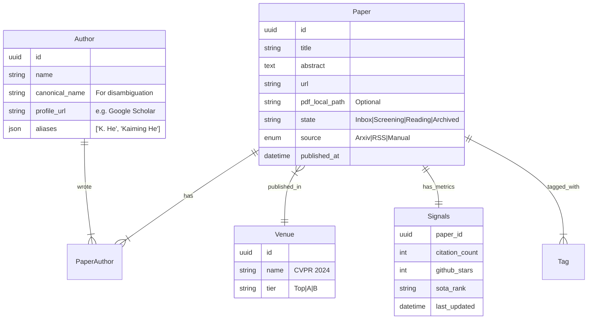

# PRKB V2 Specification: Advanced Paper Research System

> **Generated**: 2026-02-05
> **Based on**: Consultation `prkb_consultation.md`
> **Status**: DRAFT (Pending User Review)

## 1. Executive Summary

The Paper Research Knowledge Base (PRKB) V2 transitions from a simple "RSS Reader" to a **Professional Research Asset Management System**. 
Key Drivers:
*   **Deep Context**: Moving from string-based authors to First-Class Entities.
*   **Searchability**: Introducing Faceted Search (Concise UI) and Structured Syntax.
*   **Workflow**: Implementing a rigorous Kanban-like State Machine.
*   **External Intelligence**: Integrating Citations, Stars, and Deep Crawling.

## 2. Core Decisions (Consultation Results)

| Feature           | Decision              | Implementation strategy                       |
| :---------------- | :-------------------- | :-------------------------------------------- |
| **Crawling**      | **Deep + Historical** | Recursive crawler + Date-range backfill.      |
| **Entities**      | **First-Class**       | Dedicated `authors` and `venues` tables.      |
| **Storage**       | **Hybrid**            | Link-first; Optional local PDF download.      |
| **Workflow**      | **State Machine**     | Inbox -> Screening -> Reading -> Archived.    |
| **Filtering**     | **Faceted (Concise)** | Aggregation API + Sidebar UI.                 |
| **Search**        | **Hybrid Syntax**     | Visual Builder + `tag:AI` syntax support.     |
| **Signals**       | **External APIs**     | Semantic Scholar (Citations), GitHub (Stars). |
| **Visualization** | **Rich List**         | Optimized Typography, no complex graphs.      |

## 3. Data Architecture (Schema)

### 3.1 ER Diagram (Conceptual)



### 3.2 Key Schema Changes
1.  **Split `authors`**: Migrate from `jsonb ["name"]` in `papers` to `many-to-many` relation with `authors` table.
2.  **Add `signals`**: New 1:1 table to store volatile data (citations change daily) separately from static paper data.
3.  **Add `state`**: New Enum column on `papers` table.

## 4. API Specification

### 4.1 Search & List (Advanced)
`GET /api/prkb/search`

**Query Parameters:**
*   `q`: Search string (supports syntax `author:He`)
*   `facets`: `true` (returns aggregation counts)
*   `state`: Filter by workflow state
*   `sort`: `date | stars | citations`

**Response:**
```json
{
  "items": [ ... ],
  "facets": {
    "authors": [ {"value": "Kaiming He", "count": 12} ],
    "venues": [ {"value": "CVPR", "count": 20} ],
    "years": [ {"value": "2024", "count": 50} ]
  },
  "total": 100
}
```

### 4.2 Crawler Commands
`POST /api/prkb/crawl`
*   `mode`: `deep | historical | latest`
*   `target`: `paper_id` (for deep) or `query` (for historical)

## 5. UI/UX Design (Concise Philosophy)

### 5.1 The "Rich List" Card
*   **Header**: Title (Bold), Year, Venue (Badge).
*   **Meta Row**: Authors (Clickable Links), Citations (🔥 Icon), Stars (⭐ Icon).
*   **Action Row**: State Dropdown (Inbox -> Reading), PDF Link, "Download" Button.
*   **Visuals**: Clean typography, minimal borders.

### 5.2 The Facet Sidebar
*   **Behavior**: Collapsible. Default hidden or slim.
*   **Content**: Top 5 Authors, Top 5 Venues. "Show More" opens modal.
*   **Interaction**: Clicking a facet immediately filters the list.

## 6. Implementation Stages

### Stage 1: Foundation (Schema & Migration)
*   Create `authors`, `venues`, `signals` tables.
*   Migrate existing string data to entities.
*   Update `Paper` entity in Rust.

### Stage 2: Intelligence (Crawler & Signals)
*   Implement Semantic Scholar Client.
*   Implement Recursive Crawler.
*   Background Job for signal updates.

### Stage 3: Experience (Frontend)
*   Refactor `PaperCard.vue`.
*   Implement `FacetSidebar.vue`.
*   Implement "State Machine" controls.

### Stage 4: Advanced (Search & Export)
*   Implement Search Syntax Parser (`backend`).
*   Implement BibTeX/Report Export.
