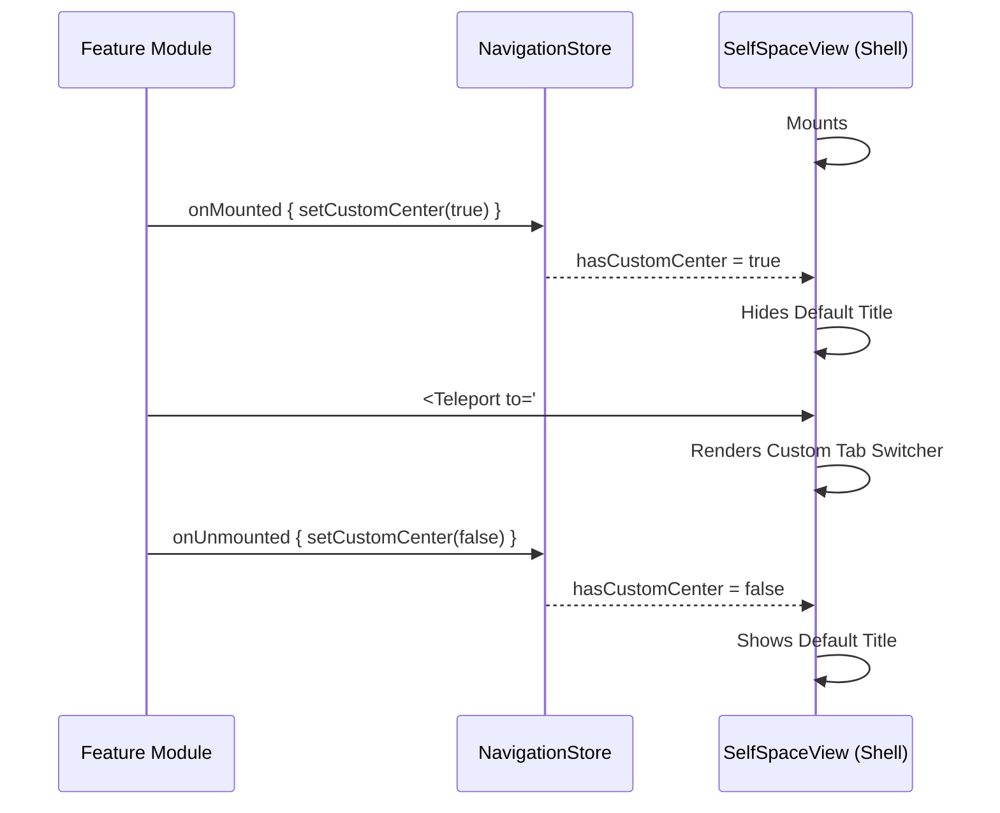

# Aether Architecture Manifesto (v1.0)

> "Order is not achieved, it is maintained."

Aether is not just a blog engine; it is a **digital consciousness kernel**. It rejects the bloat of modern web frameworks in favor of a brutally efficient, type-safe, and artistically minimalist architecture.

## 1. Core Philosophy (核心哲学)

### 1.1 The Esthetic of Void
The UI/UX follows the **"Future Minimalist"** design language:
*   **Atmosphere**: Deep cosmos backgrounds (`#050505`) with subtle atmospheric glow.
*   **Material**: Glassmorphism with ultra-thin borders (`1px solid rgba(255,255,255,0.05)`).
*   **Interaction**: Micro-interactions are fluid, governed by physics (VueUse Motion).
*   **Typography**: `Space Grotesk` for headers, `Inter` for body. Precision over decoration.

### 1.2 The Law of Separation
The backend enforces a strict **Hexagonal Architecture (Ports & Adapters)**:
*   **Domain (Inner Core)**: Pure Rust. No SQL, no HTTP, no JSON. Only logic and Traits.
*   **Application (Orchestrator)**: Connects Ports to Services.
*   **Infrastructure (Outer Shell)**: The dirty details (Postgres, Axum, Wasmtime).

## 2. Technical Stack (技术栈)

### Backend (The Kernel)
*   **Language**: Rust (Edition 2021) - Memory safety without GC.
*   **Web Framework**: Axum - Ergonomic, asynchronous, modular.
*   **Database**: Postgres 15 + SeaORM (Async ORM).
*   **Security**:
    *   **Auth**: Argon2 (Hashing) + Ed25519 (Signing).
    *   **ReBAC**: Zanzibar-style Tuple Store (`relationships`).
        *   **Model**: Relationship-Based Access Control (ReBAC).
        *   **Logic**: Recursive Graph Walk (Subject -> Group -> Entity).
*   **Observability**: `tracing` ecosystem (Structured JSON logs).
*   **Extensibility**: Wasmtime (WASM Plugin Host) - allowing hot-swappable logic.

### Frontend (The Interface)
*   **Framework**: Vue 3 (Composition API) + TypeScript.
*   **Build Tool**: Vite.
*   **UI Library**: TDesign (Customized via CSS Variables) + RemixIcon.
*   **Motion**: @vueuse/motion (Spring animations).
*   **State**: Pinia.

## 3. System Components

### 3.1 Authentication Flow
1.  **Identity**: Users are identified by `UserId` (UUID).
2.  **Verification**: Passwords are hashed with Argon2id.
3.  **Session**: Stateless JWT signed with `HS256` (migrating to Ed25519).
4.  **Guard**: Frontend `Router Guard` enforces access control at the edge.

### 3.2 Authorization Engine (ReBAC)
Aether implements a **Relationship-Based Access Control** (ReBAC) system, inspired by **Google Zanzibar**.
*   **Philosophy**: "Access is a Walk on a Graph".
*   **Storage**: Single `relationships` table storing Tuples: `(entity, relation, subject)`.
*   **Resolution**:
    1.  **Direct**: Is User U a `viewer` of Node N?
    2.  **Computed**: Is User U a `member` of Group G, which is an `owner` of Node N?
*   **Extensibility**: New logic (e.g., "Friend's content") requires NO schema changes, only new Tuple types.

### 3.3 Dynamic Navigation & Module Registration
To adhere to the "Clean Core" philosophy while allowing module-specific controls, the frontend uses a **Teleport Registration Pattern**:
*   **Host**: `SelfSpaceView` provides two DOM Portals: `#nav-center-portal` and `#nav-right-portal`.
*   **Arbitration**: `useNavigationStore` tracks the "Active State" (`hasCustomCenter`, `hasCustomRight`) to toggle between Default and Module content.
*   **Injection**: Modules (e.g., `VocabularyModule`) and Sub-Modules (e.g., `ArticleAnalysisModule`) use Vue's `<Teleport>` to inject controls (Tabs, Buttons, Toggles) directly into the global shell.
*   **Constraint**: A parent module MUST yield control (reset store state) before a child module can claim it, preventing "Zombie Buttons".


### 3.4 Dynamic Content Engine
The frontend utilizes a **Strategy Pattern** for rendering:
*   `DynamicRenderer.vue` acts as the context.
*   Specific renderers (`Markdown`, `CodeSnippet`, `Video`) are lazy-loaded.
*   This allows infinite extensibility for new content types (e.g., 3D Models, Interactive Graphs).

## 4. Directory Structure

```
Aether/
├── backend/                # The Rust Core
│   ├── src/
│   │   ├── domain/         # Pure Logic (Models, Ports)
│   │   ├── infrastructure/ # Implementation (DB, Auth, WASM)
│   │   ├── interface/      # API Handlers
│   │   └── application/    # Use Cases (Planned)
│   └── logs/               # Structured JSON logs
├── frontend/               # The Vue Interface
│   ├── src/
│   │   ├── components/     # Atomic UI Elements
│   │   ├── views/          # Page layouts (Glassmorphism)
│   │   └── stores/         # Pinia State
└── doc/                    # The Knowledge Base
```

---
*Signed,*
*The Architect*
