# Aether 架构文档

**版本:** 2.1.0  
**最后更新:** 2025年12月

## 目录

1. [系统概述](#系统概述)
2. [架构原则](#架构原则)
3. [系统架构图](#系统架构图)
4. [核心模块](#核心模块)
5. [UML类图](#uml类图)
6. [核心功能流程图](#核心功能流程图)
7. [时序图](#时序图)
8. [数据库架构](#数据库架构)
9. [API路由结构](#api路由结构)

---

## 系统概述

Aether 是一个现代化的内容发布平台，采用**模块化单体架构（Modular Monolith）**，后端使用 Rust（Axum），前端使用 Vue 3。其核心特性是**类 Git 版本控制系统**，支持完整的审计追踪、语义版本控制和差异比较。

### 技术栈

**后端 (Rust)**
- **框架**: Axum 0.7 (Web服务器), Tower (中间件)
- **数据库**: PostgreSQL (生产) / SQLite (开发) via SeaORM (异步ORM)
- **序列化**: Serde, Serde JSON
- **算法库**:
  - `md5`: 语义哈希计算
  - `similar`: Myers' Diff算法用于文本比较
  - `jsonwebtoken`: 无状态认证
  - `argon2`: 密码哈希
- **文件上传**: `axum-extra` (Multipart), `tower-http` (静态文件服务)

**前端 (Vue 3 + TypeScript)**
- **构建工具**: Vite (带代理配置)
- **状态管理**: Pinia
- **编辑器**: Tiptap (ProseMirror的Headless包装)
- **HTTP客户端**: Axios (带拦截器/显式认证)
- **样式**: Tailwind CSS
- **Markdown**: `marked` (带自定义渲染器用于TOC)

---

## 架构原则

### 1. 六边形架构 (Hexagonal Architecture)

Aether 后端严格遵循**端口与适配器模式**：

```
┌─────────────────────────────────────────┐
│          Interface Layer               │
│  (API Handlers - HTTP边界)              │
└──────────────┬──────────────────────────┘
               │
┌──────────────▼──────────────────────────┐
│          Domain Layer                   │
│  (核心业务逻辑 - 纯Rust Traits)         │
│  - Models (Article, User, Node...)      │
│  - Ports (Repository Traits)           │
│  - Services (DiffService)               │
└──────────────┬──────────────────────────┘
               │
┌──────────────▼──────────────────────────┐
│      Infrastructure Layer              │
│  (适配器实现 - 外部依赖)                 │
│  - Persistence (PostgresRepository)     │
│  - Auth (JWT Service)                  │
│  - Dictionary (StarDict Loader)        │
└─────────────────────────────────────────┘
```

### 2. 类型安全

- 所有ID使用强类型 (`UserId`, `KnowledgeBaseId`, `CommentId`)
- 使用Rust的类型系统防止非法状态
- UUID强制约束防止ID枚举攻击

### 3. 类Git版本控制

- **语义哈希**: 每次保存计算内容的SHA-256/MD5哈希
- **智能快照**: 仅在内容变化或用户明确要求时创建版本
- **ACID保证**: 版本创建与内容更新在同一事务中完成

---

## 系统架构图

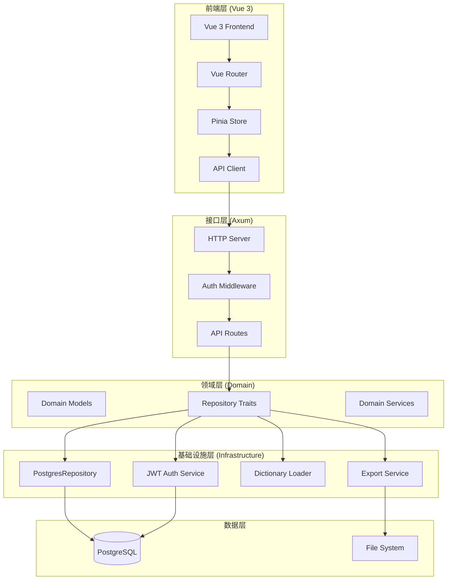

---

## 核心模块

### 1. 认证模块 (`infrastructure/auth`)

**职责**: 用户认证和授权

**核心组件**:
- `Arg2JwtAuthService`: 实现 `AuthService` trait
  - `authenticate()`: 验证用户名密码，生成JWT
  - `verify_token()`: 验证JWT令牌
  - `generate_token()`: 生成JWT令牌

**函数调用链**:
```
login_handler()
  └─> AuthService::authenticate()
      └─> UserRepository::find_by_username()
      └─> Argon2::verify_password()
      └─> AuthService::generate_token()
```

### 2. 内容管理模块 (`interface/api/content`)

**职责**: 文章的CRUD操作和版本控制

**核心组件**:
- `create_content_handler()`: 创建文章
- `update_content_handler()`: 更新文章
- `get_content_handler()`: 获取文章
- `get_content_history_handler()`: 获取版本历史
- `get_content_diff_handler()`: 获取版本差异

**函数调用链**:
```
create_content_handler()
  └─> ArticleRepository::find_by_title()  # 重复检查
  └─> ArticleRepository::save()
      └─> PostgresRepository::save()
          └─> 开始事务
          └─> 保存 Node
          └─> 保存 ArticleDetail
          └─> 计算内容哈希
          └─> 检查是否需要创建版本
          └─> 创建 ContentVersion (如需要)
          └─> 提交事务
```

### 3. 版本控制模块 (`infrastructure/persistence/repositories/article`)

**职责**: 实现类Git的版本控制系统

**核心逻辑**:
```rust
// 1. 计算当前内容哈希
let current_hash = md5::compute(body_json.to_string());

// 2. 获取最新版本
let latest_version = content_version::Entity::find()
    .filter(node_id.eq(article.id))
    .order_by_desc(version)
    .one();

// 3. 决定是否创建新版本
if latest_version.is_none() {
    // 首次保存，创建版本1
    create_version(1);
} else if latest.content_hash != current_hash || change_reason.is_some() {
    // 内容变化或用户明确要求，创建新版本
    create_version(latest.version + 1);
} else {
    // 内容未变化且无明确要求，跳过版本创建
    skip_versioning();
}
```

### 4. 差异计算模块 (`domain/diff_service`)

**职责**: 计算两个版本之间的差异

**核心组件**:
- `DiffService::compute_diff()`: 使用Myers'算法计算差异

**函数调用链**:
```
get_content_diff_handler()
  └─> ArticleRepository::get_diff()
      └─> ArticleRepository::get_version()  # 获取v1
      └─> ArticleRepository::get_version()  # 获取v2
      └─> DiffService::compute_diff()
          └─> TextDiff::from_lines()
          └─> 生成DiffChange数组
```

### 5. 评论模块 (`interface/api/comment`)

**职责**: 评论的增删查操作

**核心组件**:
- `add_comment_handler()`: 添加评论
- `get_comments_handler()`: 获取评论列表

### 6. 知识库模块 (`interface/api/knowledge_base`)

**职责**: 知识库的CRUD操作

**核心组件**:
- `create_knowledge_base_handler()`: 创建知识库
- `list_knowledge_bases_handler()`: 列出知识库
- `update_knowledge_base_handler()`: 更新知识库

### 7. 导出模块 (`infrastructure/services/export_service`)

**职责**: 导出文章为Markdown/JSON/HTML格式

**核心组件**:
- `DataExportService::export_node_with_comments()`: 导出节点及其评论

---

## UML类图

### 领域模型类图

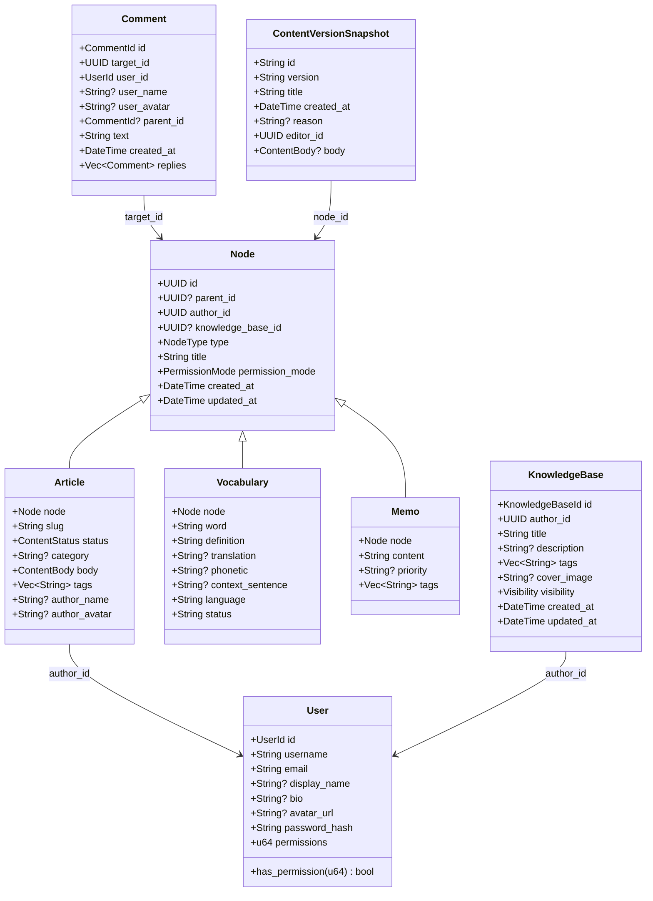

### 端口与适配器类图

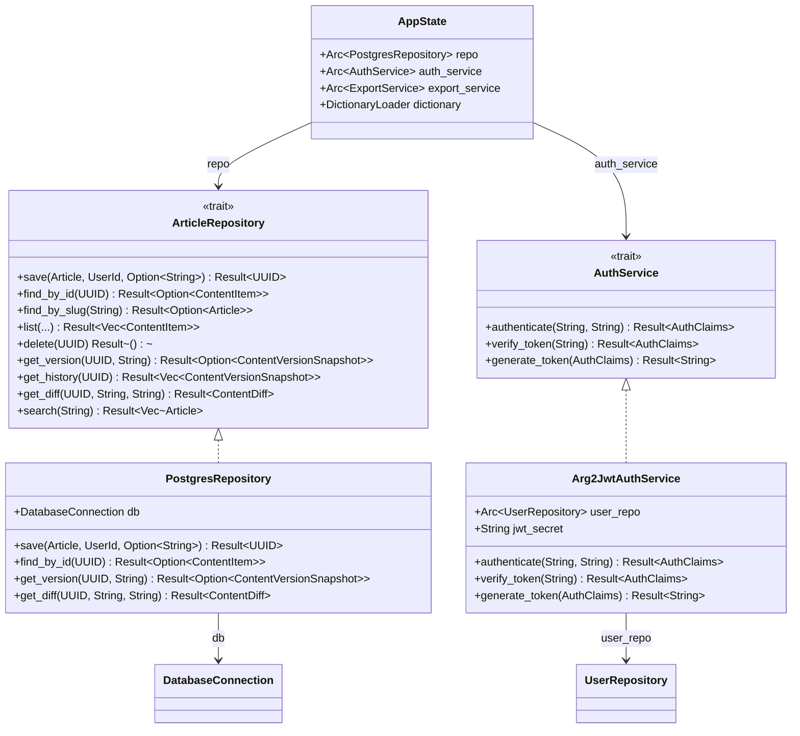

---

## 核心功能流程图

### 1. 用户登录流程

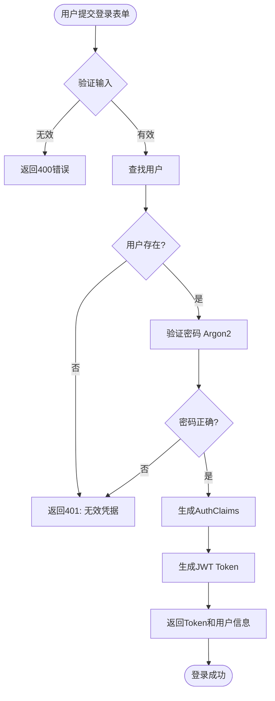

### 2. 创建文章流程

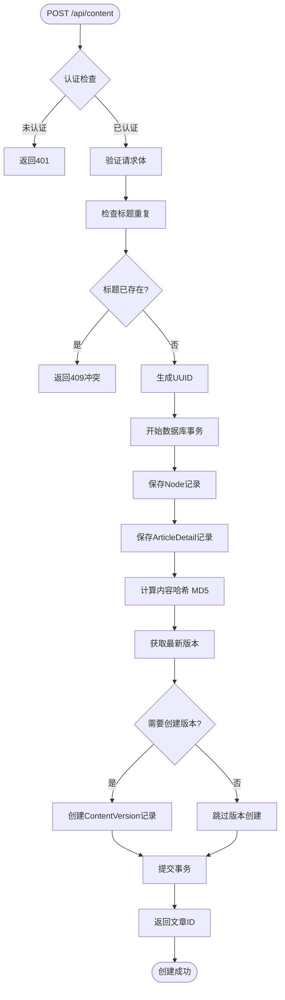

### 3. 版本控制决策流程

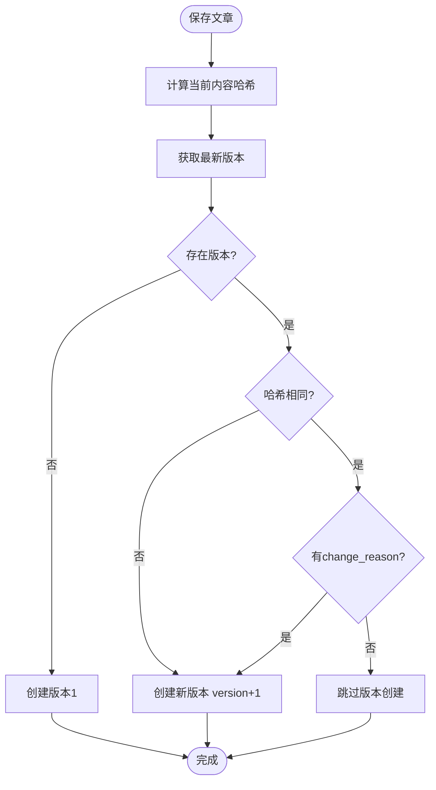

### 4. 获取版本差异流程

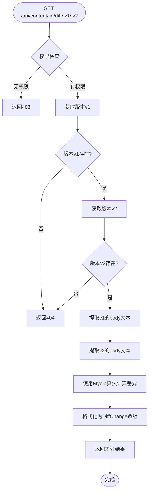

### 5. 搜索流程

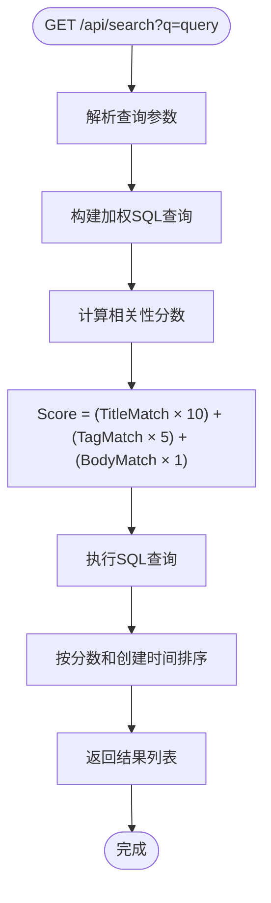

---

## 时序图

### 1. 用户登录时序图

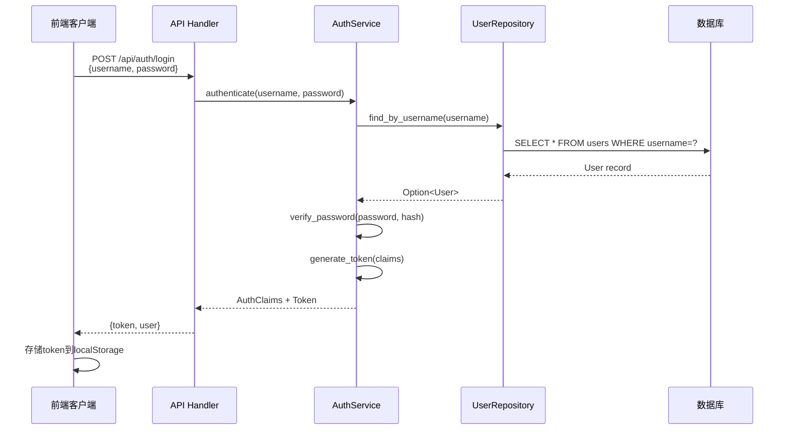

### 2. 创建文章时序图

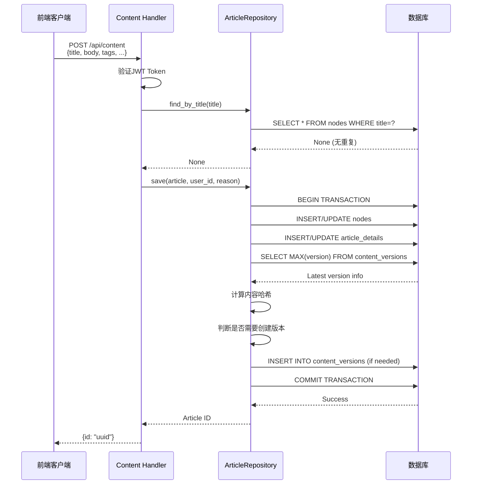

### 3. 获取版本差异时序图

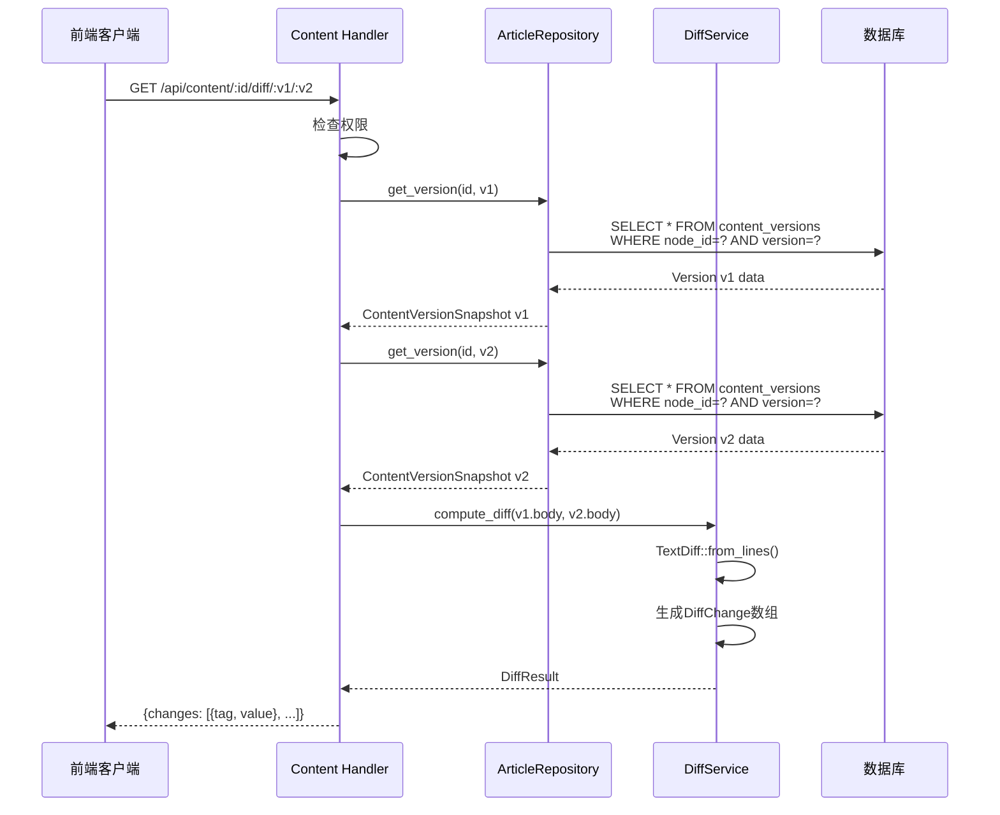

### 4. 评论添加时序图

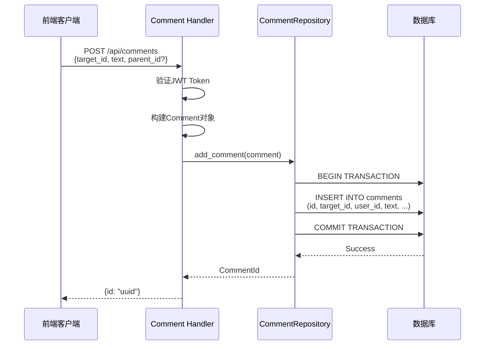

### 5. 搜索文章时序图

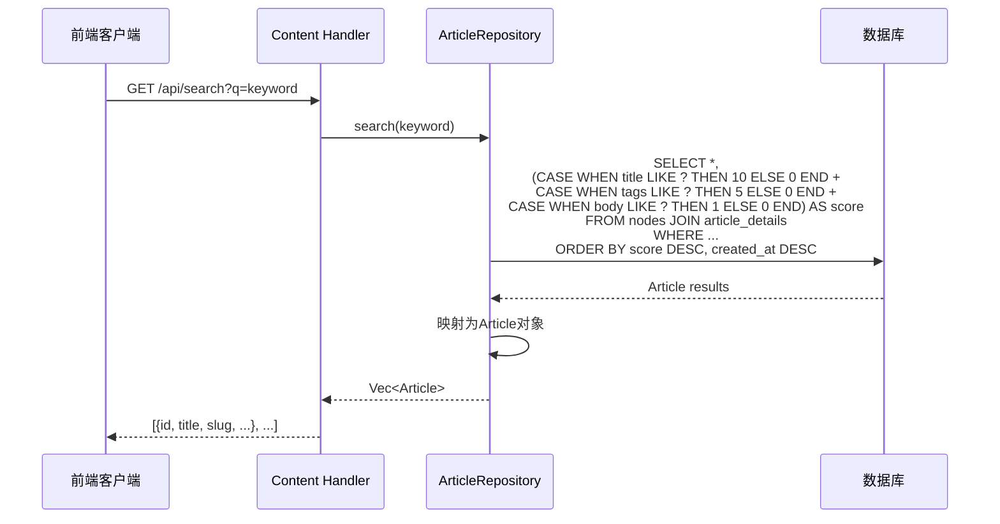

---

## 数据库架构

### 核心表结构

```mermaid
erDiagram
    users ||--o{ nodes : "author_id"
    users ||--o{ knowledge_bases : "author_id"
    users ||--o{ comments : "user_id"
    users ||--o{ content_versions : "editor_id"
    nodes ||--o| article_details : "id"
    nodes ||--o| vocab_details : "id"
    nodes ||--o| memo_details : "id"
    nodes ||--o{ content_versions : "node_id"
    nodes ||--o{ comments : "target_id"
    nodes }o--|| nodes : "parent_id"
    knowledge_bases ||--o{ nodes : "knowledge_base_id"
    users ||--o| user_drafts : "user_id"
    
    users {
        UUID id PK
        TEXT username UK
        TEXT email UK
        TEXT password_hash
        TEXT display_name
        TEXT bio
        TEXT avatar_url
        BIGINT permissions
        TIMESTAMPTZ created_at
    }
    
    nodes {
        UUID id PK
        UUID parent_id FK
        UUID author_id FK
        UUID knowledge_base_id FK
        TEXT type
        TEXT title
        TEXT permission_mode
        TEXT permission_data
        TIMESTAMPTZ created_at
        TIMESTAMPTZ updated_at
    }
    
    article_details {
        UUID id PK FK
        TEXT slug UK
        TEXT status
        TEXT category
        JSONB body
        TEXT tags
    }
    
    content_versions {
        UUID id PK
        UUID node_id FK
        INT version
        TEXT title
        JSONB body
        TEXT content_hash
        UUID editor_id FK
        TEXT change_reason
        TIMESTAMPTZ created_at
    }
    
    comments {
        UUID id PK
        UUID target_id FK
        UUID user_id FK
        UUID parent_id FK
        TEXT text
        TIMESTAMPTZ created_at
    }
    
    knowledge_bases {
        UUID id PK
        UUID author_id FK
        TEXT title
        TEXT description
        JSONB tags
        TEXT cover_image
        TEXT visibility
        TIMESTAMPTZ created_at
        TIMESTAMPTZ updated_at
    }
```

### 表关系说明

1. **users** - 用户表
   - 一对多关系：`nodes` (author_id), `knowledge_bases` (author_id), `comments` (user_id)
   - 一对一关系：`user_drafts` (user_id)

2. **nodes** - 节点表（核心表）
   - 自引用：`parent_id` 指向其他 `nodes.id`（树形结构）
   - 一对多关系：`content_versions` (node_id), `comments` (target_id)
   - 一对一关系：`article_details`, `vocab_details`, `memo_details`

3. **article_details** - 文章详情表
   - 一对一关系：`nodes` (id = nodes.id)

4. **content_versions** - 版本历史表
   - 多对一关系：`nodes` (node_id), `users` (editor_id)

5. **comments** - 评论表
   - 多对一关系：`nodes` (target_id), `users` (user_id)
   - 自引用：`parent_id` 指向其他 `comments.id`（嵌套评论）

6. **knowledge_bases** - 知识库表
   - 多对一关系：`users` (author_id)
   - 一对多关系：`nodes` (knowledge_base_id)

---

## API路由结构

### 路由组织

```mermaid
graph TD
    App[Axum Router] --> Health[GET /]
    App --> Uploads[Static /uploads]
    App --> API[API Routes]
    
    API --> Auth[Auth Routes]
    API --> Content[Content Routes]
    API --> Comment[Comment Routes]
    API --> Memo[Memo Routes]
    API --> KB[Knowledge Base Routes]
    API --> Export[Export Routes]
    API --> Upload[Upload Routes]
    API --> Tags[Tags Routes]
    API --> Vocab[Vocabulary Routes]
    API --> Dict[Dictionary Routes]
    API --> Draft[Draft Routes]
    
    Auth --> Login[POST /api/auth/login]
    Auth --> Register[POST /api/auth/register]
    Auth --> GetUser[GET /api/users/:id]
    Auth --> UpdateUser[PUT /api/users/:id]
    
    Content --> Create[POST /api/content]
    Content --> List[GET /api/content]
    Content --> Get[GET /api/content/:id]
    Content --> Update[PUT /api/content/:id]
    Content --> Delete[DELETE /api/content/:id]
    Content --> History[GET /api/content/:id/history]
    Content --> Version[GET /api/content/:id/history/:version]
    Content --> Diff[GET /api/content/:id/diff/:v1/:v2]
    Content --> Search[GET /api/search]
    
    Comment --> AddComment[POST /api/comments]
    Comment --> GetComments[GET /api/comments/:target_id]
    Comment --> BatchComments[GET /api/comments/batch]
    
    KB --> CreateKB[POST /api/knowledge-bases]
    KB --> ListKB[GET /api/knowledge-bases]
    KB --> GetKB[GET /api/knowledge-bases/:id]
    KB --> UpdateKB[PUT /api/knowledge-bases/:id]
    KB --> DeleteKB[DELETE /api/knowledge-bases/:id]
```

### 核心API端点

#### 认证相关
- `POST /api/auth/login` - 用户登录
- `POST /api/auth/register` - 用户注册
- `GET /api/users/:id` - 获取用户信息
- `PUT /api/users/:id` - 更新用户信息

#### 内容相关
- `POST /api/content` - 创建文章/文件夹
- `GET /api/content` - 列出文章（支持分页和过滤）
- `GET /api/content/:id` - 获取文章详情
- `PUT /api/content/:id` - 更新文章
- `DELETE /api/content/:id` - 删除文章
- `GET /api/content/:id/history` - 获取版本历史
- `GET /api/content/:id/history/:version` - 获取特定版本
- `GET /api/content/:id/diff/:v1/:v2` - 获取版本差异
- `GET /api/search?q=keyword` - 搜索文章

#### 评论相关
- `POST /api/comments` - 添加评论
- `GET /api/comments/:target_id` - 获取评论列表
- `GET /api/comments/batch` - 批量获取评论数量

#### 知识库相关
- `POST /api/knowledge-bases` - 创建知识库
- `GET /api/knowledge-bases` - 列出知识库
- `GET /api/knowledge-bases/:id` - 获取知识库详情
- `PUT /api/knowledge-bases/:id` - 更新知识库
- `DELETE /api/knowledge-bases/:id` - 删除知识库

#### 其他
- `POST /api/upload` - 上传文件（头像等）
- `GET /api/tags` - 获取所有标签
- `GET /api/vocabulary` - 获取词汇列表
- `GET /api/dictionary/:word` - 查询词典
- `GET /api/export/:id` - 导出文章

---

## 核心功能函数调用关系

### 1. 文章创建调用链

```
create_content_handler()
├── AuthenticatedUser::from_request_parts()
│   └── AuthService::verify_token()
│       └── UserRepository::find_by_id()
├── ArticleRepository::find_by_title()  # 重复检查
└── ArticleRepository::save()
    └── PostgresRepository::save()
        ├── 开始事务
        ├── node::Entity::insert() / update()
        ├── article_detail::Entity::insert() / update()
        ├── 计算内容哈希 (md5)
        ├── content_version::Entity::find()  # 获取最新版本
        ├── 判断是否需要创建版本
        ├── content_version::Entity::insert()  # 如需要
        └── 提交事务
```

### 2. 认证调用链

```
login_handler()
├── AuthService::authenticate()
│   ├── UserRepository::find_by_username()
│   │   └── 数据库查询
│   ├── Argon2::verify_password()
│   └── AuthService::generate_token()
│       └── jsonwebtoken::encode()
└── 返回Token和用户信息
```

### 3. 版本差异计算调用链

```
get_content_diff_handler()
├── 权限检查
│   ├── ArticleRepository::find_by_id()
│   └── 检查PermissionMode
├── ArticleRepository::get_diff()
│   ├── ArticleRepository::get_version(v1)
│   │   └── content_version::Entity::find()
│   ├── ArticleRepository::get_version(v2)
│   │   └── content_version::Entity::find()
│   └── DiffService::compute_diff()
│       └── TextDiff::from_lines()
│           └── similar::TextDiff
└── 返回DiffResult
```

### 4. 搜索调用链

```
search_content_handler()
└── ArticleRepository::search()
    └── 构建加权SQL查询
        ├── CASE WHEN title LIKE ? THEN 10 ELSE 0 END
        ├── CASE WHEN tags LIKE ? THEN 5 ELSE 0 END
        ├── CASE WHEN body LIKE ? THEN 1 ELSE 0 END
        └── ORDER BY score DESC, created_at DESC
```

---

## 总结

Aether采用**六边形架构**，严格分离了领域逻辑和基础设施实现。核心特性包括：

1. **类型安全**: 使用Rust强类型系统防止非法状态
2. **版本控制**: 类Git的智能快照机制，仅在内容变化时创建版本
3. **权限控制**: 基于JWT的无状态认证，支持细粒度权限检查
4. **可扩展性**: 通过Traits实现端口与适配器模式，易于替换实现
5. **性能优化**: 使用异步IO、数据库事务、加权搜索算法

该架构设计确保了系统的**可维护性**、**可测试性**和**可扩展性**。
