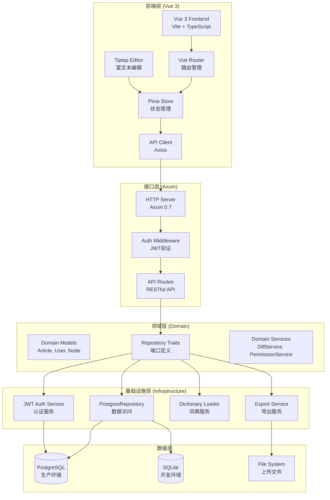
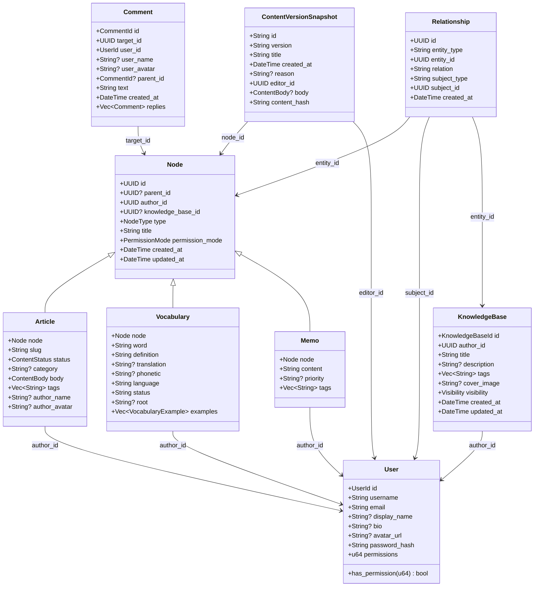
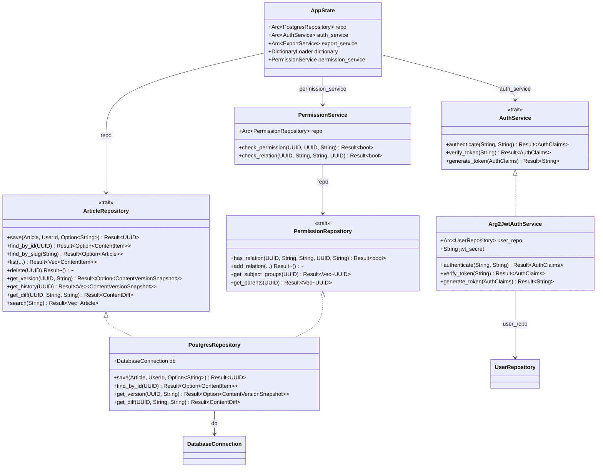
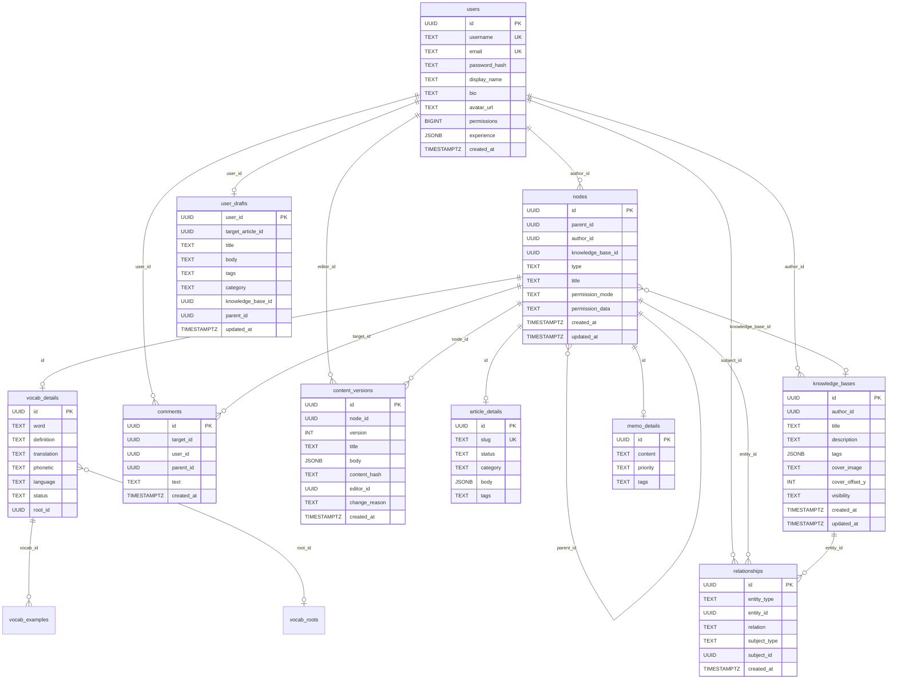
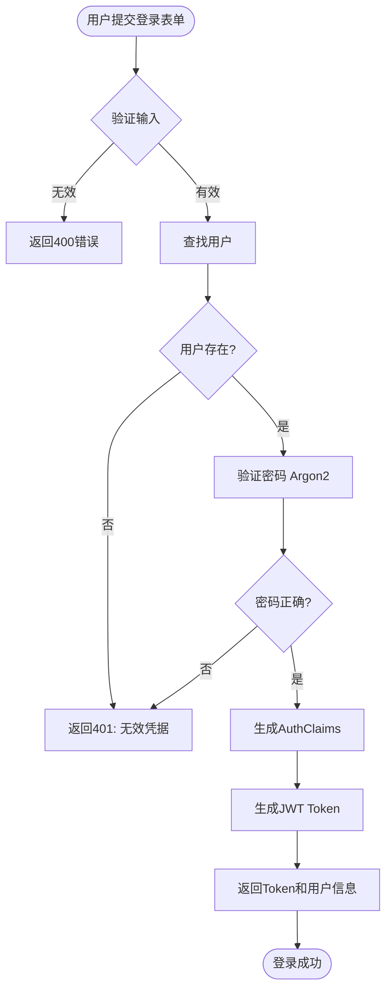
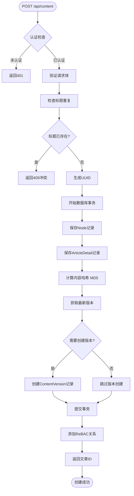
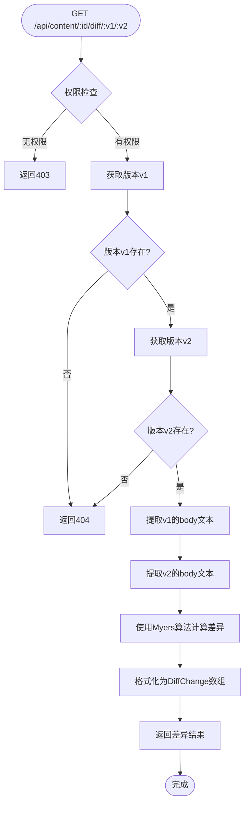
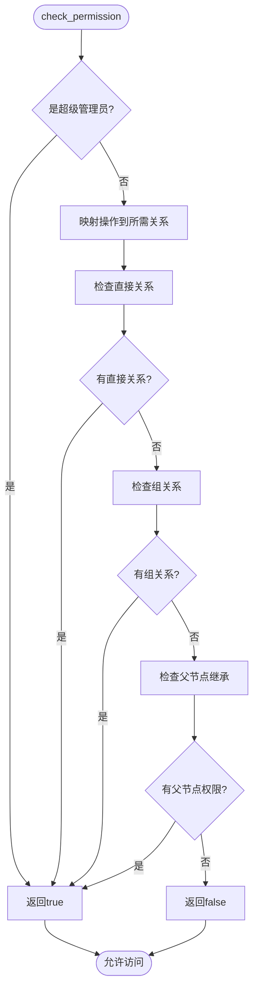

# Aether 项目答辩文档

**项目名称**: Aether - Digital Consciousness Platform  
**项目类型**: 课程设计/课程项目 + 技术分享  
**答辩日期**: [待填写]  
**版本**: 1.0.0

---

## 目录

### 第一部分：项目概述
1. [项目概述](#第一部分项目概述)
   - 1.1 [项目简介](#11-项目简介)
   - 1.2 [项目背景与目标](#12-项目背景与目标)
   - 1.3 [核心功能](#13-核心功能)
   - 1.4 [项目价值](#14-项目价值)

### 第二部分：系统架构与技术栈
2. [系统架构](#第二部分系统架构与技术栈)
   - 2.1 [整体架构设计](#21-整体架构设计)
   - 2.2 [架构原则](#22-架构原则)
   - 2.3 [技术栈选型](#23-技术栈选型)
   - 2.4 [技术选型理由](#24-技术选型理由)

### 第三部分：核心功能设计
3. [核心功能设计](#第三部分核心功能设计)
   - 3.1 [类Git版本控制系统](#31-类git版本控制系统核心创新)
   - 3.2 [知识库管理系统](#32-知识库管理系统)
   - 3.3 [权限控制系统（ReBAC）](#33-权限控制系统rebac)
   - 3.4 [内容搜索系统](#34-内容搜索系统)

### 第四部分：技术实现
4. [技术实现](#第四部分技术实现)
   - 4.1 [算法选择与实现](#41-算法选择与实现)
   - 4.2 [数据库设计](#42-数据库设计)
   - 4.3 [API设计](#43-api设计)
   - 4.4 [前端架构](#44-前端架构)
   - 4.5 [UML设计](#45-uml设计)
   - 4.6 [核心功能流程图](#46-核心功能流程图)

### 第五部分：开发过程
5. [开发过程](#第五部分开发过程)
   - 5.1 [全AI辅助开发模式](#51-全ai辅助开发模式)
   - 5.2 [规范体系建立](#52-规范体系建立)
   - 5.3 [错误记录与解决](#53-错误记录与解决)
   - 5.4 [开发挑战与解决方案](#54-开发挑战与解决方案)

### 第六部分：项目亮点
6. [项目亮点](#第六部分项目亮点)
   - 6.1 [核心创新亮点](#61-核心创新亮点)
   - 6.2 [技术亮点](#62-技术亮点)
   - 6.3 [功能亮点](#63-功能亮点)
   - 6.4 [开发模式亮点](#64-开发模式亮点)

### 第七部分：性能与安全
7. [性能与安全](#第七部分性能与安全)
   - 7.1 [性能优化](#71-性能优化)
   - 7.2 [安全性设计](#72-安全性设计)

### 第八部分：总结与展望
8. [总结与展望](#第八部分总结与展望)
   - 8.1 [项目总结](#81-项目总结)
   - 8.2 [技术收获](#82-技术收获)
   - 8.3 [未来规划](#83-未来规划)

---

# 第一部分：项目概述

### 1.1 项目简介

Aether 是一个现代化的个人知识管理和博客发布平台，采用**模块化单体架构（Modular Monolith）**，后端使用 Rust（Axum），前端使用 Vue 3。其核心特性是**类 Git 版本控制系统**，支持完整的审计追踪、语义版本控制和差异比较。

**项目定位**: 
- **课程设计项目**: 展示全栈开发能力，涵盖前端、后端、数据库设计等多个技术领域
- **技术分享**: 展示现代Web开发技术栈，特别是Rust在后端开发中的应用

### 1.2 项目背景与目标

随着个人知识管理和内容创作需求的增长，传统博客平台和知识管理工具存在以下问题：

1. **缺乏版本控制**: 大多数平台只保存当前版本，无法追溯历史修改，误操作后难以恢复
2. **知识组织能力弱**: 缺乏结构化的组织方式，内容分散，难以建立知识关联
3. **权限控制粗糙**: 传统的RBAC权限模型难以满足复杂的协作需求
4. **性能与可靠性**: 传统动态语言后端在高并发场景下性能有限，容易出现内存安全问题

**项目目标**:
- 构建一个现代化的知识管理和博客发布平台
- 实现类Git的版本控制系统，提供完整的编辑历史追踪
- 提供层级化的知识库管理，改善知识组织体验
- 采用Rust实现高性能、高可靠的后端系统
- 展示全栈开发能力和现代Web技术栈应用

### 1.3 核心功能

- ✅ **类Git版本控制系统**（核心创新）: 
  - 智能快照机制，仅在内容变化时创建版本
  - 支持任意两个版本的差异比较和可视化
  - 完整的编辑历史追踪和审计日志
  - 使用Myers' Diff算法实现精确的差异计算
- ✅ **知识库管理**: 支持创建和管理知识库，组织内容结构，提供更好的知识管理体验
- ✅ **块式编辑器**: Markdown优先，支持动态块（代码、视频等）
- ✅ **个人与社交功能**: 可自定义的个人资料、头像、简介和社交链接
- ✅ **权限控制**: 基于ReBAC（关系型访问控制）的细粒度权限系统
- ✅ **全文搜索**: 加权相关性排序算法
- ✅ **评论系统**: 支持嵌套评论和批量查询

### 1.4 项目价值

#### 1.4.1 解决的核心问题

**问题1: 传统博客平台缺少版本控制**
- **现状**: 大多数博客平台（如WordPress、Medium）只保存当前版本，无法追溯历史修改
- **痛点**: 
  - 误删或误改内容后无法恢复
  - 无法查看内容的演进历史
  - 无法比较不同版本之间的差异
- **解决方案**: 实现类Git的版本控制系统，每次内容变化自动创建版本快照，支持完整的版本历史和差异比较

**问题2: 知识管理体验不佳**
- **现状**: 传统知识管理工具（如Notion、Obsidian）缺乏结构化的组织方式
- **痛点**:
  - 内容分散，难以组织
  - 缺乏层级结构
  - 难以建立知识之间的关联
- **解决方案**: 通过知识库（Knowledge Base）和文件夹结构，提供层级化的内容组织方式，支持知识库内的内容关联

#### 1.4.2 技术目标

- **高性能**: 使用Rust实现后端，确保低延迟和高并发
- **类型安全**: 利用Rust的类型系统防止运行时错误
- **可维护性**: 采用六边形架构，清晰分离业务逻辑和基础设施
- **可扩展性**: 通过Traits实现端口与适配器模式，易于替换实现

---

# 第二部分：系统架构与技术栈

### 2.1 整体架构设计



### 2.2 架构原则

#### 2.2.1 六边形架构（Hexagonal Architecture）

Aether 后端严格遵循**端口与适配器模式**：

```
┌─────────────────────────────────────────┐
│          Interface Layer               │
│  (API Handlers - HTTP边界)              │
└──────────────┬──────────────────────────┘
               │
┌──────────────▼──────────────────────────┐
│          Domain Layer                   │
│  (核心业务逻辑 - 纯Rust Traits)         │
│  - Models (Article, User, Node...)      │
│  - Ports (Repository Traits)           │
│  - Services (DiffService)               │
└──────────────┬──────────────────────────┘
               │
┌──────────────▼──────────────────────────┐
│      Infrastructure Layer              │
│  (适配器实现 - 外部依赖)                 │
│  - Persistence (PostgresRepository)     │
│  - Auth (JWT Service)                  │
│  - Dictionary (StarDict Loader)        │
└─────────────────────────────────────────┘
```

#### 2.2.2 分层说明

1. **Interface Layer（接口层）**
   - 职责：处理HTTP请求和响应
   - 组件：Axum路由处理器
   - 特点：薄层，仅负责请求解析和响应格式化

2. **Domain Layer（领域层）**
   - 职责：核心业务逻辑
   - 组件：领域模型、端口（Traits）、领域服务
   - 特点：纯Rust代码，无外部依赖

3. **Infrastructure Layer（基础设施层）**
   - 职责：外部依赖的实现
   - 组件：数据库访问、认证服务、文件系统等
   - 特点：实现Domain Layer定义的端口

### 2.3 技术栈选型

#### 2.3.1 后端技术栈

| 技术 | 版本 | 用途 | 选择理由 |
|------|------|------|----------|
| **Rust** | Edition 2021 | 编程语言 | **核心选择**：内存安全、零成本抽象、高性能、高并发支持 |
| **Axum** | 0.7 | Web框架 | 异步、模块化、类型安全、基于Tokio |
| **SeaORM** | 0.12 | ORM框架 | 异步ORM、支持多数据库、类型安全 |
| **Tokio** | 1.x | 异步运行时 | Rust生态标准异步运行时，支持高并发 |
| **PostgreSQL** | 15+ | 生产数据库 | 功能强大、支持JSONB、事务ACID、高并发 |
| **SQLite** | - | 开发数据库 | 轻量级、无需单独服务 |
| **Serde** | 1.x | 序列化框架 | Rust标准序列化库 |
| **Argon2** | 0.5 | 密码哈希 | 抗GPU攻击、内存硬函数 |
| **JWT** | 9.x | 认证令牌 | 无状态、标准化 |
| **similar** | 2.7 | 差异算法 | Myers' Diff算法实现 |
| **md5** | 0.8 | 哈希算法 | 内容哈希计算 |

#### 2.3.2 前端技术栈

| 技术 | 版本 | 用途 | 选择理由 |
|------|------|------|----------|
| **Vue 3** | 3.5+ | 前端框架 | Composition API、响应式系统 |
| **TypeScript** | 5.5+ | 类型系统 | 类型安全、IDE支持 |
| **Vite** | 5.4+ | 构建工具 | 快速HMR、ESM支持 |
| **Pinia** | 2.2+ | 状态管理 | Vue 3官方推荐、类型安全 |
| **Vue Router** | 4.4+ | 路由管理 | Vue官方路由库 |
| **Tiptap** | 3.14+ | 富文本编辑器 | 基于ProseMirror、可扩展 |
| **TailwindCSS** | 3.4+ | CSS框架 | 实用优先、快速开发 |
| **Axios** | 1.13+ | HTTP客户端 | 拦截器、请求/响应转换 |
| **marked** | 14.0+ | Markdown解析 | 轻量级、可扩展 |

#### 2.3.3 开发工具

- **Cargo**: Rust包管理和构建工具
- **npm**: Node.js包管理
- **Docker Compose**: 容器编排（可选）

### 2.4 技术选型理由

#### 2.4.1 Rust语言选择理由（重点）

**为什么选择Rust作为后端语言？**

1. **内存安全（Memory Safety）**
   - **问题**: C/C++等语言容易出现内存泄漏、缓冲区溢出、空指针解引用等错误
   - **Rust解决方案**: 
     - 编译期所有权系统（Ownership System）保证内存安全
     - 无需垃圾回收器（GC），避免GC暂停影响性能
     - 编译期检查，运行时零开销
   - **实际收益**: 
     - 减少生产环境的内存相关bug
     - 降低系统崩溃风险
     - 提高代码可靠性

2. **零成本抽象（Zero-Cost Abstractions）**
   - **概念**: 高级抽象（如迭代器、模式匹配）编译后性能等同于手写的底层代码
   - **实际应用**:
     - 使用`async/await`编写异步代码，性能等同于手写的回调
     - 使用迭代器链式操作，编译优化后性能最优
     - 类型系统在编译期消除运行时开销
   - **收益**: 
     - 代码可读性和可维护性高
     - 性能不妥协
     - 开发效率提升

3. **高并发需求**
   - **项目需求**: 
     - 支持多用户同时编辑和发布内容
     - 版本控制操作需要高并发处理
     - 搜索和查询需要快速响应
   - **Rust优势**:
     - **Tokio异步运行时**: 基于事件驱动的异步IO，支持百万级并发连接
     - **无锁并发**: 使用`Arc`、`Mutex`等类型安全的并发原语
     - **零成本并发**: 异步代码编译后性能接近手写的epoll/kqueue
   - **性能对比**（参考）:
     - Rust + Tokio: 可处理10万+并发连接
     - Node.js: 受限于单线程，并发能力有限
     - Go: 有GC暂停，高并发时延迟不稳定

4. **类型安全（Type Safety）**
   - **编译期检查**: 类型错误在编译期发现，而非运行时
   - **强类型系统**: 防止类型混淆和隐式转换错误
   - **实际收益**: 
     - 减少运行时错误
     - 提高代码质量
     - IDE支持更好（自动补全、重构）

5. **生态系统成熟度**
   - **Web框架**: Axum、Actix-web等成熟的异步Web框架
   - **数据库**: SeaORM提供类型安全的ORM
   - **工具链**: Cargo包管理器、rustfmt格式化工具、clippy代码检查

**与其他语言的对比**:

| 特性 | Rust | Node.js | Go | Python |
|------|------|---------|-----|--------|
| 内存安全 | ✅ 编译期保证 | ❌ 运行时检查 | ⚠️ 部分保证 | ❌ GC依赖 |
| 性能 | ⭐⭐⭐⭐⭐ | ⭐⭐⭐ | ⭐⭐⭐⭐ | ⭐⭐ |
| 并发能力 | ⭐⭐⭐⭐⭐ | ⭐⭐⭐ | ⭐⭐⭐⭐ | ⭐⭐ |
| 类型安全 | ⭐⭐⭐⭐⭐ | ⭐⭐ | ⭐⭐⭐⭐ | ⭐⭐ |
| 开发效率 | ⭐⭐⭐ | ⭐⭐⭐⭐⭐ | ⭐⭐⭐⭐ | ⭐⭐⭐⭐⭐ |

**总结**: Rust在保证高性能和高并发的同时，提供了内存安全和类型安全，非常适合构建需要高可靠性和高性能的Web后端系统。

#### 2.4.2 其他技术选型理由

- **Axum**: 现代化的异步Web框架，基于Tokio，类型安全且易于使用
- **SeaORM**: 提供类型安全的ORM，支持异步操作和多数据库
- **Vue 3**: 采用Composition API，提供更好的代码组织和类型支持
- **PostgreSQL**: 功能强大的关系型数据库，支持JSONB和复杂查询

---

# 第三部分：核心功能设计

### 3.1 类Git版本控制系统（核心创新）

#### 3.1.1 设计理念与创新点

Aether实现了**类Git的版本控制系统**，这是项目的核心创新点。传统博客平台（如WordPress、Medium）只保存当前版本，无法追溯历史修改，而Aether借鉴Git的设计思想，为内容管理提供了完整的版本控制能力。

**核心思想**:
- **不可变性**: 版本记录一旦创建，永不修改（`content_versions`表是只追加的），保证历史记录的完整性
- **智能快照**: 仅在内容变化时创建版本，避免冗余版本，节省存储空间
- **语义哈希**: 使用MD5哈希快速检测内容变化，O(1)时间复杂度
- **ACID保证**: 版本创建与内容更新在同一数据库事务中完成，确保数据一致性
- **完整审计**: 每个版本记录编辑者ID和变更原因，支持完整的审计追踪

**与Git的相似之处**:
- ✅ **快照机制**: 每次保存创建完整的内容快照（类似Git的commit）
- ✅ **版本号**: 使用递增的整数版本号（类似Git的commit hash）
- ✅ **差异比较**: 支持任意两个版本的差异比较（类似Git的diff）
- ✅ **变更原因**: 支持可选的变更说明（类似Git的commit message）

**与Git的不同之处**:
- 🔄 **自动化**: 版本创建是自动的，无需用户手动提交
- 🔄 **智能检测**: 通过哈希比较自动判断是否需要创建版本
- 🔄 **强制版本**: 即使内容未变化，如果用户提供了变更原因，仍会创建版本

#### 3.1.2 版本创建逻辑

**核心实现**（`backend/src/infrastructure/persistence/repositories/article.rs`）:

```rust
// 1. 计算当前内容哈希
let current_hash = format!("{:x}", md5::compute(body_json.to_string()));

// 2. 获取最新版本
let max_ver_query = content_version::Entity::find()
    .filter(content_version::Column::NodeId.eq(article.node.id))
    .order_by_desc(content_version::Column::Version)
    .one(&txn)
    .await?;

// 3. 判断是否需要创建版本
let (new_version, should_save_version) = match max_ver_query {
    Some(latest) => {
        if latest.content_hash == current_hash && change_reason.is_none() {
            // 内容未变化且无明确要求 -> 跳过版本创建
            (latest.version, false)
        } else {
            // 内容变化或用户明确要求 -> 创建新版本
            (latest.version + 1, true)
        }
    },
    None => (1, true), // 首次保存，创建版本1
};

// 4. 如需要，创建版本记录（在同一事务中）
if should_save_version {
    let version_model = content_version::ActiveModel {
        id: Set(Uuid::new_v4()),
        node_id: Set(article.node.id),
        version: Set(new_version),
        title: Set(article.node.title),
        body: Set(body_json),
        change_reason: Set(change_reason),
        content_hash: Set(current_hash),
        editor_id: Set(editor_id.0),
        created_at: Set(Utc::now().into()),
    };
    content_version::Entity::insert(version_model).exec(&txn).await?;
}

// 5. 提交事务（确保原子性）
txn.commit().await?;
```

**关键设计决策**:
- **哈希比较**: 使用MD5快速检测内容变化，避免不必要的版本创建
- **强制版本**: 即使内容未变化，如果用户提供了`change_reason`，仍会创建版本（支持手动提交）
- **事务保证**: 版本创建和内容更新在同一事务中，确保数据一致性

#### 3.1.3 版本查询逻辑

- **获取版本历史**: `GET /api/content/:id/history`
- **获取特定版本**: `GET /api/content/:id/history/:version`
- **获取版本差异**: `GET /api/content/:id/diff/:v1/:v2`

### 3.2 知识库管理系统

#### 3.2.1 设计理念

知识库（Knowledge Base）是Aether提供的**核心知识管理功能**，解决了传统知识管理工具缺乏结构化组织的问题。

**核心价值**:
- **层级化组织**: 支持知识库 → 文件夹 → 文章的多层级结构
- **内容关联**: 同一知识库内的内容可以相互关联和引用
- **权限隔离**: 每个知识库可以设置独立的访问权限
- **封面定制**: 支持自定义封面图片和偏移量，个性化展示

**使用场景**:
- 📚 **学习笔记**: 按课程或主题组织学习笔记
- 📖 **技术文档**: 按项目或技术栈组织技术文档
- 🎯 **个人知识库**: 构建个人的知识体系

#### 3.2.2 数据结构

**知识库表结构**:
```sql
CREATE TABLE knowledge_bases (
    id UUID PRIMARY KEY,
    author_id UUID NOT NULL,
    title TEXT NOT NULL,
    description TEXT,
    tags JSONB NOT NULL DEFAULT '[]',
    cover_image TEXT,
    cover_offset_y INT NOT NULL DEFAULT 50,
    visibility TEXT NOT NULL DEFAULT 'Private',
    created_at TIMESTAMPTZ NOT NULL,
    updated_at TIMESTAMPTZ NOT NULL
);
```

**关联关系**:
- 知识库 → 节点（Node）: 一对多关系，通过`nodes.knowledge_base_id`关联
- 知识库 → 用户（User）: 多对一关系，每个知识库属于一个作者

#### 3.2.3 核心功能

1. **创建知识库**: 用户可以创建多个知识库，每个知识库独立管理
2. **内容组织**: 在知识库内创建文件夹和文章，形成树形结构
3. **权限控制**: 支持Public/Private/Internal三种可见性级别
4. **批量操作**: 支持批量移动、删除知识库内的内容

### 3.3 权限控制系统（ReBAC）

#### 3.3.1 设计理念

Aether实现了**关系型访问控制（Relationship-Based Access Control）**，灵感来自Google Zanzibar。

**核心思想**: "访问权限是在图上的遍历"

**优势**:
- **灵活性**: 无需修改数据库模式即可支持新的权限关系
- **可扩展性**: 支持复杂的权限继承和组合
- **细粒度**: 可以对每个实体设置不同的访问权限

#### 3.3.2 权限模型

**关系表结构** (`relationships`):
```sql
CREATE TABLE relationships (
    id UUID PRIMARY KEY,
    entity_type TEXT NOT NULL,  -- "node", "knowledge_base"
    entity_id UUID NOT NULL,
    relation TEXT NOT NULL,      -- "viewer", "editor", "owner"
    subject_type TEXT NOT NULL,  -- "user", "group"
    subject_id UUID NOT NULL,
    created_at TIMESTAMPTZ NOT NULL,
    UNIQUE (entity_type, entity_id, relation, subject_type, subject_id)
);
```

**关系类型映射**:
- `"read"` 操作 → 需要 `viewer`, `editor`, `owner`, `author`, `parent` 关系
- `"write"` 操作 → 需要 `editor`, `owner`, `author` 关系
- `"delete"` 操作 → 需要 `owner`, `author` 关系

#### 3.3.3 权限检查流程

**实现**（`backend/src/domain/permission_service.rs`）:

```rust
pub async fn check_permission(&self, user_id: Uuid, node_id: Uuid, action: &str) -> Result<bool> {
    // 1. 超级管理员绕过（优化）
    if user.permissions == u64::MAX {
        return Ok(true);
    }
    
    // 2. 映射操作到所需关系
    let required_relations = match action {
        "read" => vec!["viewer", "editor", "owner", "author", "parent"],
        "write" => vec!["editor", "owner", "author"],
        "delete" => vec!["owner", "author"],
        _ => return Ok(false),
    };
    
    // 3. 开始图遍历
    for relation in required_relations {
        if self.check_relation(node_id, "node", relation, user_id).await? {
            return Ok(true);
        }
    }
    Ok(false)
}
```

**图遍历策略**（递归）:
1. **直接关系检查**: 用户U是否是节点N的`viewer`？
2. **组关系检查**: 用户U是否是组G的`member`，而组G是节点N的`owner`？
3. **继承检查**: 节点N是否有父节点，用户是否有父节点的相同关系？
4. **公共组**: 所有用户自动属于`public`组（UUID::nil()）

**性能优化**:
- 超级管理员直接返回`true`，避免图遍历
- 使用数据库索引加速关系查询
- 支持权限缓存（未来优化）

### 3.4 内容搜索系统

#### 3.4.1 加权相关性排序算法

Aether实现了**加权相关性排序算法**，直接在数据库查询层计算相关性分数：

```
Score = (TitleMatch × 10) + (TagMatch × 5) + (BodyMatch × 1)
```

**权重设计理由**:
- **标题匹配（10分）**: 标题包含关键词通常表示高度相关，用户最可能寻找的就是标题匹配的内容
- **标签匹配（5分）**: 标签表示文章主题，中等重要性，有助于发现相关主题的内容
- **正文匹配（1分）**: 正文中的提及相关性较低，但仍有参考价值

#### 3.4.2 实现方式

使用SQL的`CASE`表达式在查询时动态计算分数，然后按分数降序排序，确保最相关的内容排在前面。

---

# 第四部分：技术实现

### 4.1 算法选择与实现

#### 4.1.1 差异计算算法：Myers' Diff Algorithm（重点）

##### 4.1.1.1 算法选择与背景

Aether使用**Myers' Diff Algorithm**（也称为"最长公共子序列"算法）来计算两个版本之间的差异。这是Git等版本控制系统使用的标准算法。

**为什么选择Myers' Diff Algorithm？**

1. **效率优势**: 
   - 时间复杂度: O(ND)，其中N是文件大小，D是差异数量
   - 空间复杂度: O(N)
   - 对于大多数实际场景，D远小于N，因此实际性能接近O(N)

2. **准确性保证**:
   - 生成**最小编辑距离**的差异，保证结果最优
   - 找到最少的插入和删除操作来将一个版本转换为另一个版本
   - 保证差异结果的一致性和可预测性

3. **成熟度与可靠性**:
   - 被Git、Subversion等主流版本控制系统广泛使用
   - 经过数十年的实践验证，算法稳定可靠
   - 有大量优化实现和最佳实践可参考

4. **可扩展性**:
   - 支持行级差异计算（用于文本文件）
   - 支持字符级差异计算（用于代码片段）
   - 可以扩展到更复杂的结构化数据

##### 4.1.1.2 算法原理

**Myers' Diff Algorithm的核心思想**:
- 将差异计算问题转化为**图搜索问题**
- 在编辑图中寻找从起点到终点的最短路径
- 路径上的每一步代表一个字符的匹配、插入或删除

**算法步骤**（简化版）**:
1. 构建编辑图：将两个文本版本映射到二维网格
2. 寻找最短路径：使用动态规划找到最少编辑操作
3. 生成差异序列：将路径转换为Insert/Delete/Equal操作序列

##### 4.1.1.3 实现细节

**核心代码**（`backend/src/domain/diff_service.rs`）:

```rust
use similar::{ChangeTag, TextDiff};

pub fn compute_diff(old_text: &str, new_text: &str) -> DiffResult {
    // 使用similar库实现Myers' Diff算法
    // TextDiff::from_lines() 使用行级差异计算
    let diff = TextDiff::from_lines(old_text, new_text);
    let mut changes = Vec::new();
    
    // 遍历所有差异变化
    for change in diff.iter_all_changes() {
        let tag = match change.tag() {
            ChangeTag::Delete => "Delete".to_string(),  // 删除的行
            ChangeTag::Insert => "Insert".to_string(),  // 新增的行
            ChangeTag::Equal => "Equal".to_string(),    // 未变化的行
        };
        changes.push(DiffChange {
            tag,
            value: change.to_string(),
        });
    }
    
    DiffResult { changes }
}
```

**使用的库**: `similar` (v2.7.0)
- Rust生态中成熟的差异计算库
- 实现了Myers' Diff算法的优化版本
- 支持多种差异计算模式（行级、字符级、单词级）

##### 4.1.1.4 输出格式与前端渲染

**API输出格式**:
```json
{
  "changes": [
    {"tag": "Equal", "value": "未变化的内容行"},
    {"tag": "Delete", "value": "被删除的内容行"},
    {"tag": "Insert", "value": "新增的内容行"}
  ]
}
```

**前端渲染策略**:
- `Equal`: 正常显示，保持原样
- `Delete`: 
  - 红色背景高亮
  - 显示删除线（strikethrough）
  - 左侧显示"-"标记
- `Insert`: 
  - 绿色背景高亮
  - 左侧显示"+"标记
  - 可能显示行号

**用户体验**:
- 直观的颜色区分（红/绿）让用户快速识别变化
- 行级差异显示，便于理解大段内容的修改
- 支持并排对比和统一视图两种显示模式

##### 4.1.1.5 性能优化

**优化策略**:
1. **行级计算**: 对于大文件，使用行级差异而非字符级，减少计算量
2. **缓存机制**: 可以缓存已计算的差异结果（未来优化）
3. **异步处理**: 差异计算在后台异步进行，不阻塞主请求

**性能指标**（参考）:
- 10KB文本文件: < 10ms
- 100KB文本文件: < 100ms
- 1MB文本文件: < 1s

#### 4.1.2 密码哈希算法

##### 4.1.2.1 算法选择：Argon2

**选择理由**:
1. **抗GPU攻击**: 内存硬函数，难以并行化
2. **可配置性**: 可调整内存和CPU成本
3. **标准化**: 2015年密码哈希竞赛获胜者

#### 4.1.3 内容哈希算法

##### 4.1.3.1 算法选择：MD5

**选择理由**:
1. **速度**: 快速计算，适合频繁调用（每次保存都需要计算）
2. **碰撞检测**: 用于检测内容变化，不需要密码学安全
3. **简单性**: 实现简单，Rust标准库支持
4. **足够性**: 对于内容变化检测，MD5的碰撞概率极低，完全满足需求

**实现**:
```rust
let current_hash = format!("{:x}", md5::compute(body_json.to_string()));
```

**使用场景**:
- 版本控制：检测内容是否变化
- 去重：避免创建重复版本
- 完整性检查：确保版本数据未被篡改

**安全说明**: 
- ⚠️ MD5**不用于**密码或安全相关场景
- ✅ 仅用于内容变化检测，不涉及安全威胁
- ✅ 密码哈希使用Argon2（见4.1.2节）

#### 4.1.4 认证算法

##### 4.1.4.1 JWT（JSON Web Token）

**选择理由**:
1. **无状态**: 服务器不需要存储会话
2. **标准化**: RFC 7519标准
3. **可扩展**: 可携带自定义声明

**实现**:
- 使用`jsonwebtoken`库实现JWT生成和验证
- Token包含用户ID、权限信息等声明
- 支持Token过期和刷新机制

---

### 4.2 数据库设计

#### 4.2.1 核心表结构

##### 4.2.1.1 nodes表（核心表）

采用**类表继承（Class Table Inheritance）**策略：
- `nodes`表存储通用元数据
- `article_details`、`vocab_details`、`memo_details`存储特定类型数据

##### 4.2.1.2 content_versions表（版本历史）

- **不可变性**: 版本记录一旦创建，永不修改
- **完整性**: 每个版本包含完整的内容快照
- **审计**: 记录编辑者ID和变更原因

#### 4.2.2 数据库关系图



#### 4.5.2 端口与适配器类图



#### 4.5.3 核心实体关系说明

- **Node**: 核心实体，所有内容的基础，采用类表继承策略
- **Article**: 文章，继承自Node，存储在`article_details`表
- **Vocabulary**: 词汇，继承自Node，存储在`vocab_details`表
- **Memo**: 备忘录，继承自Node，存储在`memo_details`表
- **User**: 用户实体，所有内容的作者
- **Comment**: 评论，关联到Node，支持嵌套结构
- **KnowledgeBase**: 知识库，包含多个Node，组织内容结构
- **ContentVersionSnapshot**: 版本快照，关联到Node，记录历史版本
- **Relationship**: 关系表，实现ReBAC权限控制




### 4.3 API设计

#### 4.3.1 RESTful API设计原则

- **资源导向**: URL表示资源，HTTP方法表示操作
- **状态码**: 正确使用HTTP状态码（200成功，400客户端错误，401未授权，403禁止，404未找到，409冲突，500服务器错误）
- **统一前缀**: 所有API端点以`/api`开头
- **认证**: 使用Bearer Token（JWT）进行认证

#### 4.3.2 核心API端点

##### 4.3.2.1 认证相关

| 方法 | 路径 | 说明 | 认证 |
|------|------|------|------|
| POST | `/api/auth/login` | 用户登录 | 否 |
| POST | `/api/auth/register` | 用户注册 | 否 |
| GET | `/api/users/:id` | 获取用户信息 | 是 |
| PUT | `/api/users/:id` | 更新用户信息 | 是 |

##### 4.3.2.2 内容相关

| 方法 | 路径 | 说明 | 认证 |
|------|------|------|------|
| POST | `/api/content` | 创建文章/文件夹 | 是 |
| GET | `/api/content` | 列出文章（支持分页和过滤） | 可选 |
| GET | `/api/content/:id` | 获取文章详情 | 可选 |
| PUT | `/api/content/:id` | 更新文章 | 是 |
| DELETE | `/api/content/:id` | 删除文章 | 是 |
| GET | `/api/content/:id/history` | 获取版本历史 | 是 |
| GET | `/api/content/:id/history/:version` | 获取特定版本 | 是 |
| GET | `/api/content/:id/diff/:v1/:v2` | 获取版本差异 | 是 |
| GET | `/api/search?q=keyword` | 搜索文章 | 否 |

##### 4.3.2.3 评论相关

| 方法 | 路径 | 说明 | 认证 |
|------|------|------|------|
| POST | `/api/comments` | 添加评论 | 是 |
| GET | `/api/comments/:target_id` | 获取评论列表 | 否 |
| GET | `/api/comments/batch` | 批量获取评论数量 | 否 |

##### 4.3.2.4 知识库相关

| 方法 | 路径 | 说明 | 认证 |
|------|------|------|------|
| POST | `/api/knowledge-bases` | 创建知识库 | 是 |
| GET | `/api/knowledge-bases` | 列出知识库 | 是 |
| GET | `/api/knowledge-bases/:id` | 获取知识库详情 | 是 |
| PUT | `/api/knowledge-bases/:id` | 更新知识库 | 是 |
| DELETE | `/api/knowledge-bases/:id` | 删除知识库 | 是 |

##### 4.3.2.5 其他

| 方法 | 路径 | 说明 | 认证 |
|------|------|------|------|
| POST | `/api/upload` | 上传文件（头像等） | 是 |
| GET | `/api/tags` | 获取所有标签 | 否 |
| GET | `/api/vocabulary` | 获取词汇列表 | 是 |
| GET | `/api/dictionary/:word` | 查询词典 | 否 |
| GET | `/api/export/:id` | 导出文章 | 是 |
| GET | `/api/draft` | 获取草稿 | 是 |
| PUT | `/api/draft` | 保存草稿 | 是 |

### 4.4 前端架构

#### 4.4.1 组件架构

**分层设计**:
- **原子组件** (`components/`): 可复用的UI组件（Button, Input, Card等）
- **页面组件** (`views/`): 完整的页面视图（Home, Editor, ReadView等）
- **组合式函数** (`composables/`): 可复用的逻辑（useContent, useAuth等）

**核心组件**:
- `EditorView.vue`: 富文本编辑器，使用Tiptap
- `ReadView.vue`: 阅读视图，支持Markdown渲染和TOC
- `SearchBar.vue`: 搜索栏组件
- `DynamicRenderer.vue`: 动态内容渲染器（策略模式）

#### 4.4.2 状态管理

使用Pinia进行状态管理：

**Auth Store** (`stores/auth.ts`):
- `user`: 当前用户信息
- `token`: JWT令牌
- `isAuthenticated`: 认证状态
- `login()`, `logout()`: 登录/登出方法

**Content Store** (计划中):
- 内容缓存
- 编辑状态管理

#### 4.4.3 路由设计

```mermaid
graph TD
    Root[/] --> Home[HomeView<br/>首页]
    Root --> Login[LoginView<br/>登录]
    Root --> Register[RegisterView<br/>注册]
    Root --> Search[SearchView<br/>搜索]
    Root --> Editor[EditorView<br/>编辑器]
    Root --> Read[ReadView<br/>阅读]
    Root --> Profile[ProfileView<br/>个人资料]
    Root --> Settings[SettingsView<br/>设置]
    Root --> SelfSpace[SelfSpaceView<br/>个人空间]
    
    Editor --> EditorNew[/editor/new<br/>新建]
    Editor --> EditorEdit[/editor/:id<br/>编辑]
    
    Read --> ReadArticle[/article/:id<br/>文章]
    Read --> ReadKB[/kb/:id<br/>知识库]
    
    SelfSpace --> SelfSpaceKB[/self-space/kb<br/>知识库列表]
    SelfSpace --> SelfSpaceArticle[/self-space/article<br/>文章列表]
    SelfSpace --> SelfSpaceMemo[/self-space/memo<br/>备忘录列表]
    SelfSpace --> SelfSpaceVocab[/self-space/vocab<br/>词汇列表]
```

**路由守卫**:
- 认证路由（如Editor, Settings）需要登录
- 未登录用户重定向到登录页
- 已登录用户访问登录页重定向到首页

### 4.6 核心功能流程图

#### 4.6.1 用户登录流程



#### 4.6.2 创建文章流程



#### 4.6.3 版本差异计算流程



#### 4.6.4 权限检查流程（ReBAC）


---

# 第五部分：开发过程

### 5.1 全AI辅助开发模式

**Aether项目的一个独特特点是：整个项目采用AI辅助开发模式**，所有代码、文档和架构设计都在AI的协助下完成。这带来了独特的挑战和解决方案。

#### 5.1.1 挑战：如何保证AI开发的一致性和质量？

**核心问题**:
- AI模型在不同会话中可能产生不一致的代码风格
- AI可能重复已解决的错误
- AI可能违反已建立的架构约束
- 缺乏统一的开发规范和错误记录机制

### 5.2 规范体系建立

#### 5.2.1 规范文档体系

项目建立了完整的AI开发规范体系，位于`AI/`文件夹下：

- **`AI/project_spec.md`** - **项目宪法（Constitution）**
  - 定义了AI代理的**核心指令（Primary Directive）**
  - 规定了技术栈、架构模式、编码标准
  - 明确了**禁止行为**（如：禁止Panic、禁止使用SemVer版本号）
  - 要求AI在实现前必须阅读此文档

- **`AI/AGENT_PROMPT.md`** - **AI代理提示词模板**
  - 标准化的AI任务分配模板
  - 确保每个AI代理都遵循相同的初始化流程
  - 强制要求AI先阅读规范文档再开始编码

- **`AI/roadmap.md`** - **项目路线图**
  - 记录已完成的功能和当前开发阶段
  - 提供项目上下文，帮助AI理解当前状态
  - 避免重复开发已完成的功能

### 5.3 错误记录与解决

#### 5.3.1 错误记录体系

所有开发过程中遇到的错误都被详细记录和总结：

- **`AI/ERROR_LOG.md`** - **错误日志总览**
  - 以表格形式总结所有已知错误
  - 包含：错误描述、根本原因、解决方案、详细报告链接
  - 共记录了**32个已解决的错误**

- **`AI/error/*.md`** - **详细错误报告**
  - 每个错误都有独立的详细报告文件
  - 包含：问题描述、根本原因分析、解决方案、回归测试、预防清单
  - 示例：`content_creation_race_condition.md` 详细记录了竞态条件的发现和解决过程

**错误记录的价值**:
- ✅ **防止重复错误**: AI在实现新功能前必须检查错误日志
- ✅ **知识积累**: 将错误和解决方案转化为可复用的知识
- ✅ **质量保证**: 通过错误记录提高代码质量

#### 5.3.2 验证脚本体系

- 每个核心功能都有对应的验证脚本（`debug_*.sh`）
- 确保功能实现后可以快速验证
- 防止功能回归

### 5.4 开发挑战与解决方案

#### 5.4.1 实际案例：内容创建竞态条件

**问题描述**:
用户报告在发布新文章时出现"409 Conflict: Article with this title already exists"错误，即使标题是唯一的。

**根本原因**:
- Auto-Save和Publish操作同时触发POST请求
- 缺乏全局状态锁机制
- 代码逻辑分散在多个地方

**解决方案**:
1. **集中化状态管理**: 将所有内容创建操作集中到`useContent` composable
2. **状态锁机制**: 使用`isSaving`标志防止并发操作
3. **架构重构**: 移除所有直接的`axios`调用，统一使用composable

**详细记录**:
- 错误报告：`AI/error/content_creation_race_condition.md`
- 错误总结：`AI/ERROR_LOG.md`第27行

**预防措施**:
- 建立了"禁止直接使用axios进行状态变更操作"的规则
- 要求所有mutating操作必须通过composable进行

#### 5.4.2 规范体系的效果

**统计数据**:
- 📋 **规范文档**: 3个核心文档（project_spec.md, AGENT_PROMPT.md, roadmap.md）
- 🐛 **错误记录**: 32个已解决的错误，每个都有详细报告
- ✅ **验证脚本**: 20+个调试脚本，覆盖核心功能
- 📚 **知识积累**: 错误报告总字数超过10,000字

**实际效果**:
- ✅ **一致性**: AI开发遵循统一的规范和架构
- ✅ **质量**: 通过错误记录避免重复错误
- ✅ **效率**: 新功能开发速度提升，减少调试时间
- ✅ **可维护性**: 完整的文档体系便于后续维护

#### 5.4.3 经验总结

**全AI开发的最佳实践**:

1. **建立规范体系**
   - 制定明确的开发规范（Constitution）
   - 使用标准化的提示词模板
   - 维护项目路线图

2. **记录所有错误**
   - 详细记录每个错误的根本原因
   - 总结解决方案和预防措施
   - 建立错误知识库

3. **验证机制**
   - 为每个功能编写验证脚本
   - 确保功能实现后可以快速验证
   - 防止功能回归

4. **持续改进**
   - 根据错误记录更新规范
   - 将经验教训转化为规则
   - 建立知识积累机制

**项目亮点**: 
Aether项目展示了如何通过完善的规范体系和错误记录机制，实现高质量的AI辅助开发。这不仅提高了开发效率，还保证了代码质量和系统稳定性。

---

# 第六部分：项目亮点

### 6.1 核心创新亮点

#### 6.1.1 类Git版本控制系统

**创新点**:
1. **智能快照机制**: 
   - 自动检测内容变化，仅在必要时创建版本
   - 使用MD5哈希快速判断内容是否变化
   - 避免冗余版本，节省存储空间

2. **完整的版本历史**:
   - 每个版本包含完整的内容快照
   - 记录编辑者ID和变更原因
   - 支持任意版本的查看和恢复

3. **精确的差异计算**:
   - 使用Myers' Diff算法（Git使用的算法）
   - 生成最小编辑距离的差异
   - 支持行级和字符级差异显示

4. **用户体验优化**:
   - 版本创建对用户透明，无需手动操作
   - 直观的差异可视化（红/绿高亮）
   - 支持版本对比和回滚操作

#### 6.1.2 知识库管理系统

**创新点**:
1. **层级化组织**: 知识库 → 文件夹 → 文章的多层级结构
2. **内容关联**: 同一知识库内的内容可以相互关联
3. **个性化定制**: 支持封面图片和自定义样式
4. **权限隔离**: 每个知识库独立的访问控制

1. **Rust后端**: 
   - 内存安全，零成本抽象
   - 高性能，低延迟
   - 类型安全，编译期错误检查

2. **六边形架构**: 
   - 清晰的架构分层
   - 业务逻辑与基础设施分离
   - 易于测试和维护

3. **ReBAC权限系统**: 
   - 灵活的权限控制
   - 支持复杂的权限继承
   - 无需修改数据库模式即可扩展

4. **异步编程**: 
   - 使用Tokio异步运行时
   - 高并发处理能力
   - 非阻塞IO操作

### 6.3 功能亮点

1. **智能版本控制**: 仅在内容变化时创建版本，节省存储
2. **差异可视化**: 直观的版本差异展示，使用Myers' Diff算法
3. **知识库管理**: 组织化的内容管理，提升知识管理体验
4. **全文搜索**: 加权相关性排序，确保搜索结果质量
5. **富文本编辑**: 基于Tiptap的现代化编辑器，支持Markdown
6. **评论系统**: 支持嵌套评论和批量查询

### 6.4 开发模式亮点

**全AI辅助开发模式**:
- 📋 **完善的规范体系**: 3个核心规范文档，确保开发一致性
- 🐛 **详细的错误记录**: 32个已解决错误的完整记录和总结
- ✅ **验证脚本体系**: 20+个调试脚本，覆盖核心功能
- 📚 **知识积累机制**: 将错误和解决方案转化为可复用的知识库

**创新价值**:
- 展示了AI辅助开发的最佳实践
- 证明了通过规范体系可以实现高质量的AI开发
- 为AI辅助开发提供了可复用的方法论

---

# 第七部分：性能与安全

### 7.1 性能优化

#### 7.1.1 后端优化

##### 7.1.1.1 异步IO与高并发

- **Tokio异步运行时**: 
  - 基于事件驱动的异步IO模型
  - 支持单线程处理大量并发连接
  - 零成本异步抽象，性能接近系统调用

- **数据库连接池**: 
  - SeaORM自动管理连接池
  - 复用数据库连接，减少连接开销
  - 支持连接池大小配置

- **事务优化**: 
  - 合理使用数据库事务，减少锁竞争
  - 版本创建和内容更新在同一事务中，保证原子性
  - 避免长事务，减少数据库锁定时间

##### 7.1.1.2 算法优化

- **版本控制优化**:
  - 使用MD5哈希快速检测内容变化（O(1)）
  - 仅在内容变化时创建版本，避免冗余存储
  - 版本查询使用索引加速

- **搜索优化**:
  - 加权相关性排序在数据库层计算，减少数据传输
  - 使用数据库索引加速搜索查询
  - 限制搜索结果数量，避免大量数据传输

##### 7.1.1.3 内存优化

- **零拷贝**: Rust的所有权系统避免不必要的内存拷贝
- **引用计数**: 使用`Arc`共享数据，避免重复存储
- **缓存策略**: 使用`moka`缓存词典查询结果

#### 7.1.2 前端优化

- **代码分割**: Vite自动代码分割，按需加载
- **懒加载**: 路由和组件懒加载，减少初始加载时间
- **缓存策略**: 
  - 合理使用浏览器缓存
  - localStorage缓存草稿内容
  - 避免重复请求相同数据

#### 7.1.3 性能指标（目标）

- **API响应时间**: < 100ms（95%分位）
- **并发处理能力**: 支持1000+并发用户
- **版本创建时间**: < 50ms
- **差异计算时间**: < 100ms（10KB文本）
- **搜索响应时间**: < 200ms

#### 4.6.2 创建文章流程


#### 4.6.3 版本差异计算流程


#### 4.6.4 权限检查流程（ReBAC）



---

# 第五部分：开发过程

### 5.1 全AI辅助开发模式

**Aether项目的一个独特特点是：整个项目采用AI辅助开发模式**，所有代码、文档和架构设计都在AI的协助下完成。这带来了独特的挑战和解决方案。

#### 5.1.1 挑战：如何保证AI开发的一致性和质量？

**核心问题**:
- AI模型在不同会话中可能产生不一致的代码风格
- AI可能重复已解决的错误
- AI可能违反已建立的架构约束
- 缺乏统一的开发规范和错误记录机制

### 5.2 规范体系建立

#### 5.2.1 规范文档体系

项目建立了完整的AI开发规范体系，位于`AI/`文件夹下：

- **`AI/project_spec.md`** - **项目宪法（Constitution）**
  - 定义了AI代理的**核心指令（Primary Directive）**
  - 规定了技术栈、架构模式、编码标准
  - 明确了**禁止行为**（如：禁止Panic、禁止使用SemVer版本号）
  - 要求AI在实现前必须阅读此文档

- **`AI/AGENT_PROMPT.md`** - **AI代理提示词模板**
  - 标准化的AI任务分配模板
  - 确保每个AI代理都遵循相同的初始化流程
  - 强制要求AI先阅读规范文档再开始编码

- **`AI/roadmap.md`** - **项目路线图**
  - 记录已完成的功能和当前开发阶段
  - 提供项目上下文，帮助AI理解当前状态
  - 避免重复开发已完成的功能

### 5.3 错误记录与解决

#### 5.3.1 错误记录体系

所有开发过程中遇到的错误都被详细记录和总结：

- **`AI/ERROR_LOG.md`** - **错误日志总览**
  - 以表格形式总结所有已知错误
  - 包含：错误描述、根本原因、解决方案、详细报告链接
  - 共记录了**32个已解决的错误**

- **`AI/error/*.md`** - **详细错误报告**
  - 每个错误都有独立的详细报告文件
  - 包含：问题描述、根本原因分析、解决方案、回归测试、预防清单
  - 示例：`content_creation_race_condition.md` 详细记录了竞态条件的发现和解决过程

**错误记录的价值**:
- ✅ **防止重复错误**: AI在实现新功能前必须检查错误日志
- ✅ **知识积累**: 将错误和解决方案转化为可复用的知识
- ✅ **质量保证**: 通过错误记录提高代码质量

#### 5.3.2 验证脚本体系

- 每个核心功能都有对应的验证脚本（`debug_*.sh`）
- 确保功能实现后可以快速验证
- 防止功能回归

### 5.4 开发挑战与解决方案

#### 5.4.1 实际案例：内容创建竞态条件

**问题描述**:
用户报告在发布新文章时出现"409 Conflict: Article with this title already exists"错误，即使标题是唯一的。

**根本原因**:
- Auto-Save和Publish操作同时触发POST请求
- 缺乏全局状态锁机制
- 代码逻辑分散在多个地方

**解决方案**:
1. **集中化状态管理**: 将所有内容创建操作集中到`useContent` composable
2. **状态锁机制**: 使用`isSaving`标志防止并发操作
3. **架构重构**: 移除所有直接的`axios`调用，统一使用composable

**详细记录**:
- 错误报告：`AI/error/content_creation_race_condition.md`
- 错误总结：`AI/ERROR_LOG.md`第27行

**预防措施**:
- 建立了"禁止直接使用axios进行状态变更操作"的规则
- 要求所有mutating操作必须通过composable进行

#### 5.4.2 规范体系的效果

**统计数据**:
- 📋 **规范文档**: 3个核心文档（project_spec.md, AGENT_PROMPT.md, roadmap.md）
- 🐛 **错误记录**: 32个已解决的错误，每个都有详细报告
- ✅ **验证脚本**: 20+个调试脚本，覆盖核心功能
- 📚 **知识积累**: 错误报告总字数超过10,000字

**实际效果**:
- ✅ **一致性**: AI开发遵循统一的规范和架构
- ✅ **质量**: 通过错误记录避免重复错误
- ✅ **效率**: 新功能开发速度提升，减少调试时间
- ✅ **可维护性**: 完整的文档体系便于后续维护

#### 5.4.3 经验总结

**全AI开发的最佳实践**:

1. **建立规范体系**
   - 制定明确的开发规范（Constitution）
   - 使用标准化的提示词模板
   - 维护项目路线图

2. **记录所有错误**
   - 详细记录每个错误的根本原因
   - 总结解决方案和预防措施
   - 建立错误知识库

3. **验证机制**
   - 为每个功能编写验证脚本
   - 确保功能实现后可以快速验证
   - 防止功能回归

4. **持续改进**
   - 根据错误记录更新规范
   - 将经验教训转化为规则
   - 建立知识积累机制

**项目亮点**: 
Aether项目展示了如何通过完善的规范体系和错误记录机制，实现高质量的AI辅助开发。这不仅提高了开发效率，还保证了代码质量和系统稳定性。

---

# 第八部分：总结与展望

### 8.1 项目总结

#### 8.1.1 技术收获

##### 8.1.1.1 Rust语言实践

- **内存安全**: 通过Rust的所有权系统，避免了常见的内存错误
- **类型系统**: 强类型系统在编译期发现错误，减少运行时bug
- **异步编程**: 掌握了Tokio异步编程模型，实现了高并发后端
- **生态系统**: 熟悉了Rust的Web开发生态系统（Axum、SeaORM等）

##### 8.1.1.2 架构设计能力

- **六边形架构**: 理解了端口与适配器模式，实现了清晰的架构分层
- **领域驱动设计**: 通过Domain Layer的设计，理解了DDD的核心思想
- **可扩展性设计**: 通过Traits和接口，实现了系统的可扩展性

##### 8.1.1.3 全栈开发能力

- **前端**: Vue 3 Composition API、Pinia状态管理、Tiptap编辑器
- **后端**: Rust异步Web开发、数据库设计、API设计
- **全栈**: 前后端数据格式对接、状态同步、错误处理

#### 8.1.2 全AI开发经验

##### 8.1.2.1 规范的重要性

- **规范文档**: 建立了完善的规范体系，确保AI开发的一致性
- **错误记录**: 通过详细的错误记录，避免了重复错误
- **知识积累**: 将错误和解决方案转化为可复用的知识

##### 8.1.2.2 AI辅助开发的优势

- **效率提升**: AI可以快速生成代码和文档，提高开发效率
- **质量保证**: 通过规范体系，确保AI生成的代码符合标准
- **知识传承**: 错误记录和规范文档可以作为知识传承的载体

##### 8.1.2.3 挑战与解决

- **一致性**: 通过规范文档和错误记录，解决了AI开发的一致性问题
- **质量**: 通过验证脚本和错误记录，保证了代码质量
- **可维护性**: 通过完善的文档体系，提高了系统的可维护性

#### 8.1.3 项目管理经验

- **需求管理**: 通过roadmap.md管理项目需求和进度
- **错误管理**: 通过ERROR_LOG.md管理错误和解决方案
- **文档管理**: 建立了完善的文档体系，便于知识传承

#### 8.1.4 反思与改进

##### 8.1.4.1 做得好的地方

- ✅ **规范体系**: 建立了完善的AI开发规范体系
- ✅ **错误记录**: 详细记录了所有错误和解决方案
- ✅ **架构设计**: 采用了清晰的六边形架构
- ✅ **版本控制**: 实现了类Git的版本控制系统

##### 8.1.4.2 需要改进的地方

- ⚠️ **功能模块化**: 英语、知识库等功能应该可以自由开关
- ⚠️ **程序对接**: 需要对接更多的外部程序和服务
- ⚠️ **性能优化**: 需要更多的性能测试和优化
- ⚠️ **用户体验**: 需要更多的用户反馈和改进

### 8.2 技术收获

（内容已整合到8.1.1节）

### 8.3 未来规划

#### 8.3.1 功能完善

##### 8.3.1.1 核心功能增强

- **版本控制增强**:
  - 支持版本合并（类似Git merge）
  - 支持版本分支（类似Git branch）
  - 支持版本标签和注释

- **知识库功能增强**:
  - 支持知识库模板
  - 支持知识库导入/导出
  - 支持知识库协作（多人编辑）

- **搜索功能增强**:
  - 集成Meilisearch全文搜索引擎
  - 支持高级搜索语法
  - 支持搜索历史和建议

##### 8.3.1.2 新功能开发

- **可视化功能**:
  - 知识图谱可视化
  - 内容关系图
  - 数据统计图表

- **协作功能**:
  - 多人实时协作编辑
  - 评论和讨论系统增强
  - 权限管理细化

#### 8.3.2 功能模块化（重点）

##### 8.3.2.1 设计理念

**目标**: 实现功能的自由开关，让用户可以根据需求启用或禁用特定功能模块。

**核心功能模块**:
- ✅ **核心内容管理**（Article、Memo、Vocabulary）- 必需模块
- 🔧 **英语学习模块**（Vocabulary、Dictionary）- 可选模块
- 🔧 **知识库模块**（Knowledge Base）- 可选模块
- 🔧 **评论系统**（Comment）- 可选模块
- 🔧 **导出功能**（Export）- 可选模块

##### 8.3.2.2 实现方案

**配置方式**:
```toml
# config.toml
[features]
# 核心功能（必需）
core = true

# 可选功能模块
english_learning = true    # 英语学习模块
knowledge_base = true      # 知识库模块
comment_system = true      # 评论系统
export_feature = true      # 导出功能
```

**后端实现**:
- 使用Rust的`features`机制实现功能开关
- 在编译时根据配置启用/禁用功能模块
- API路由根据功能开关动态注册

**前端实现**:
- 根据后端返回的功能配置动态加载组件
- 路由根据功能开关动态注册
- UI根据功能开关显示/隐藏相关功能

**数据库设计**:
- 添加`feature_flags`表存储功能开关配置
- 支持用户级别的功能开关（未来扩展）

##### 8.3.2.3 功能模块列表

| 功能模块 | 状态 | 说明 | 依赖 |
|---------|------|------|------|
| **核心内容管理** | 必需 | Article、Memo基础功能 | - |
| **英语学习模块** | 可选 | Vocabulary、Dictionary、Fuzzy Search | 核心 |
| **知识库模块** | 可选 | Knowledge Base、Folder结构 | 核心 |
| **评论系统** | 可选 | Comment、Nested Comments | 核心 |
| **导出功能** | 可选 | Export to Markdown/JSON/HTML | 核心 |
| **权限系统** | 可选 | ReBAC权限控制 | 核心 |
| **搜索功能** | 可选 | Full-text Search、Meilisearch | 核心 |

#### 8.3.3 程序对接

##### 8.3.3.1 集成目标

**目标**: 对接更多的外部程序和服务，扩展Aether的功能和生态。

##### 8.3.3.2 对接计划

**1. 版本控制系统对接**
- **Git集成**: 
  - 支持将知识库导出为Git仓库
  - 支持从Git仓库导入内容
  - 支持Git hooks和CI/CD集成

- **GitHub/GitLab集成**:
  - 支持同步到GitHub/GitLab仓库
  - 支持从GitHub/GitLab导入Issue和PR
  - 支持Markdown文件的双向同步

**2. 笔记软件对接**
- **Obsidian集成**:
  - 支持导入Obsidian vault
  - 支持双向同步
  - 支持Obsidian插件生态

- **Notion集成**:
  - 支持导入Notion页面
  - 支持导出到Notion
  - 支持Notion数据库同步

**3. 学习平台对接**
- **Anki集成**:
  - 支持将Vocabulary导出为Anki卡片
  - 支持从Anki导入卡片
  - 支持FSRS算法同步

- **Quizlet集成**:
  - 支持导出到Quizlet
  - 支持从Quizlet导入学习集

**4. 云存储对接**
- **云存储同步**:
  - 支持同步到Google Drive、Dropbox、OneDrive
  - 支持自动备份
  - 支持版本历史同步

**5. API开放**
- **RESTful API**:
  - 完善API文档（OpenAPI/Swagger）
  - 支持API密钥认证
  - 支持Webhook通知

- **GraphQL API**:
  - 提供GraphQL接口
  - 支持复杂查询
  - 支持实时订阅

##### 8.3.3.3 对接架构设计

**插件系统**:
- 设计插件接口（Plugin Interface）
- 支持第三方插件开发
- 插件市场和管理系统

**数据转换层**:
- 统一的数据格式转换接口
- 支持多种数据格式（Markdown、JSON、HTML等）
- 支持自定义转换规则

**同步机制**:
- 双向同步引擎
- 冲突解决策略
- 增量同步优化

#### 8.3.4 技术优化

##### 8.3.4.1 性能优化

- **数据库优化**:
  - 查询优化和索引优化
  - 连接池优化
  - 缓存策略优化

- **前端优化**:
  - 代码分割和懒加载优化
  - 虚拟滚动（大列表）
  - 图片懒加载和CDN

- **API优化**:
  - 响应压缩（gzip/brotli）
  - 请求合并和批处理
  - GraphQL数据加载优化

##### 8.3.4.2 安全性增强

- **认证增强**:
  - OAuth2.0支持
  - 双因素认证（2FA）
  - SSO单点登录

- **数据安全**:
  - 端到端加密（E2EE）
  - 数据备份和恢复
  - 审计日志增强

##### 8.3.4.3 可观测性

- **监控系统**:
  - 性能监控（APM）
  - 错误追踪（Error Tracking）
  - 日志聚合和分析

- **分析系统**:
  - 用户行为分析
  - 功能使用统计
  - 性能指标分析

#### 8.3.5 路线图时间表

**Phase 1: 功能模块化（1-2个月）**
- [ ] 实现功能开关机制
- [ ] 重构代码支持模块化
- [ ] 添加功能配置界面

**Phase 2: 程序对接（2-3个月）**
- [ ] Git/GitHub集成
- [ ] Obsidian/Notion集成
- [ ] API开放和文档

**Phase 3: 功能完善（持续）**
- [ ] 版本控制增强
- [ ] 知识库功能增强
- [ ] 搜索功能增强

**Phase 4: 技术优化（持续）**
- [ ] 性能优化
- [ ] 安全性增强
- [ ] 可观测性建设

---

## 待完善内容

以下内容需要进一步补充：

1. [x] 系统整体架构图（Mermaid）
2. [x] 详细的UML类图
3. [x] 核心功能的详细流程图
4. [x] 数据库ER图
5. [x] API端点的详细说明
6. [x] 前端路由结构图
7. [x] 全AI开发挑战与解决方案（重点）
8. [x] 项目总结与反思
9. [x] 未来规划
10. [ ] 性能测试数据
11. [ ] 安全性测试结果
12. [ ] 项目演示截图
13. [x] 项目背景与目标
14. [x] 技术选型的详细理由
15. [x] 遇到的挑战与解决方案

---

**文档状态**: 初稿，待完善  
**最后更新**: [待填写]
